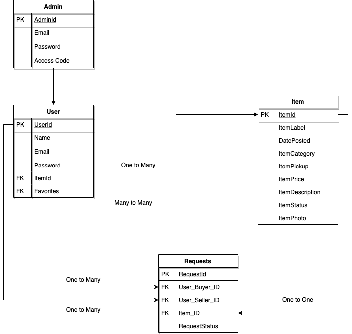

# Database Scheme

For the database scheme, data formation is narrowed down to four main tables. User table stores information such as user id, name, login credentials, items they want to trade, and their favorite items. OneToMany relationship between User and Item: for a buyer, they can buy many items, but an item can only belong to one buyer; for a seller, they can sell many items, but items can not belong to many sellers. Item table stores information such as item id, date posted, item category, item price, item description, item status, and item photo URL. A user can opt to request an item, which will notify a seller one of their items have been requested. Request table stores information such as request id, FK user_buyer_id, FK  user_seller_id, FK item_id, and request status. There is a OneToOne relationship for Request to Item, there can be only one request per item and vice-versa. For buyer and seller (users), there is a OneToMany relationship from User to Request since the buyer/seller can have many requests but a request can only belong to one buyer and/or seller. Finally, we have a separate table for admin login credentials. 
