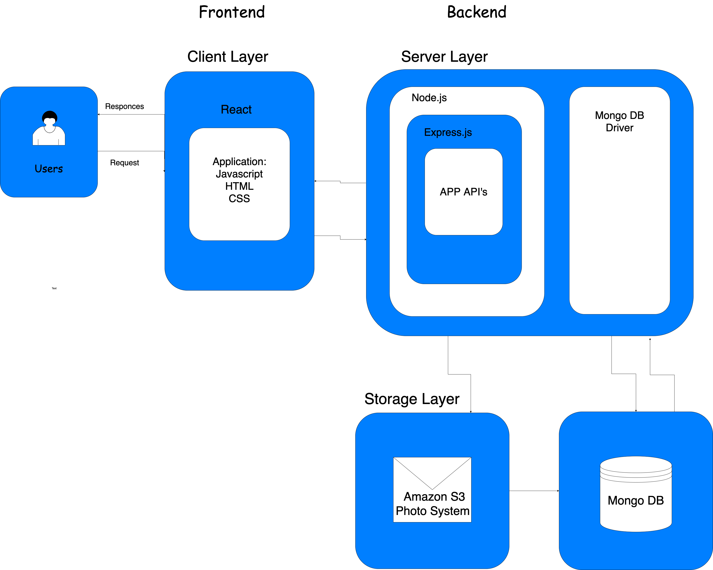

# Infrastructure

For client-side, we will use HTML, CSS, and Javascript, and in our case, with the dependencies of React. For the backend services, Node.js is used to interact with the database and files; therefore, no direct contact from the client to the storage layer. Encompassed by Node.js is Express.js which acts like a middle-ware that funnels requests through functions, includes routing, view-rendering, models, and so forth. Finally, for the storage layer, MongoDB is used to store documents in collections, and Amazon S3 service for our photo storage. Rather than storing the images directly in MongoDB with GridFS, we will store images there and store the assigned URLs in MongoDB. 
