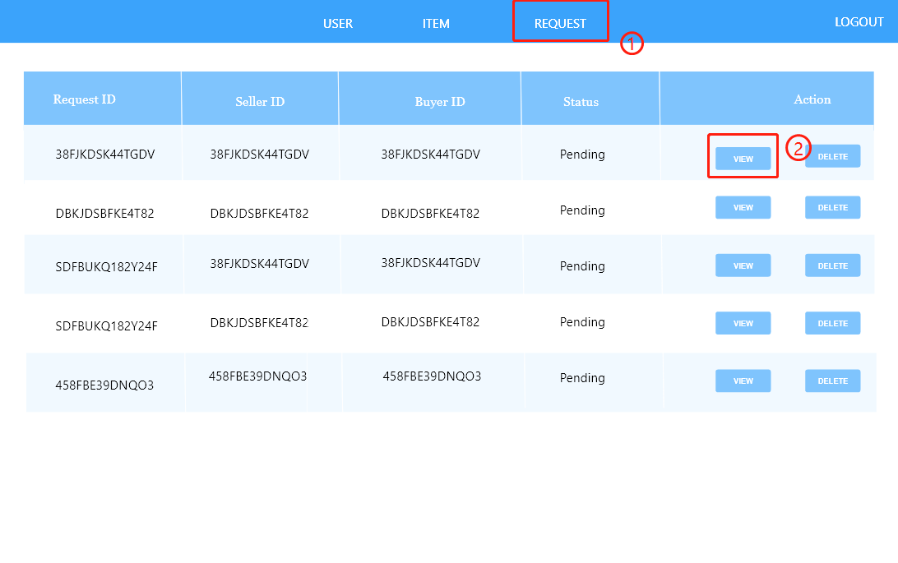

### Admin User Story

I receive a different login screen than standard users. I input my credentials and click on LOGIN.

After login successfully, I present with the user data tables with action buttons, view, update and delete. I click on VIEW to check out the user profile.

I receive a dialog with the user information. I click OK when I finish reading.

I am sent back to the user data table. I click UPDATE to change the user information as required.

I receive a form dialog and I change the information for the user. I click CONFIRM to apply the changes.

I am sent back to the user data table. I click DELETE to delete the user due to inappropriate posting.

I receive a dialog and I click YES to confirm my action.

1. I click on ITEM to change the view to the item data table. I am able to perform view and delete actions on items.
2. I click on VIEW to view the item information.

I receive a dialog with the item information. I click OK when I finish reading.

I am sent back to the item data table. I click DELETE to delete the inappropriate item.

I receive a dialog and I click YES to confirm my action.

1. I click on REQUEST to change the view to the request data table. I am able to perform view and delete actions on requests.
2. I click on VIEW to view the request information.

I receive a dialog with the request information. I click OK when I finish reading.

I am sent back to the request data table. I click DELETE to delete the wrong request made by a user.

I receive a dialog and I click YES to confirm my action.

When I finish, I click LOGOUT to make sure no one else can take advantage of the database.