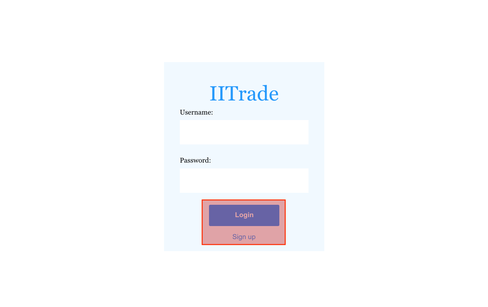
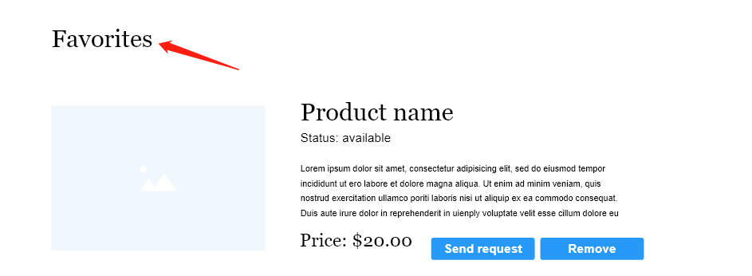
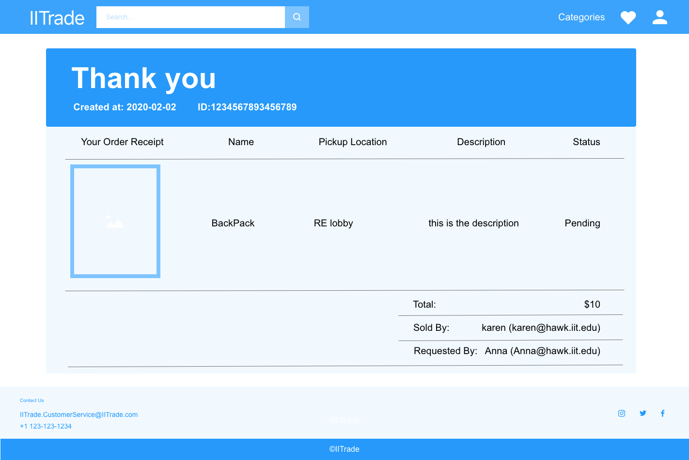
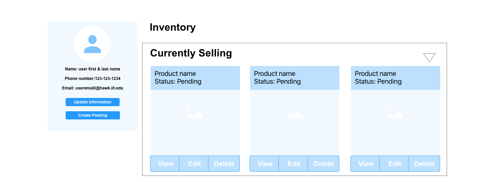
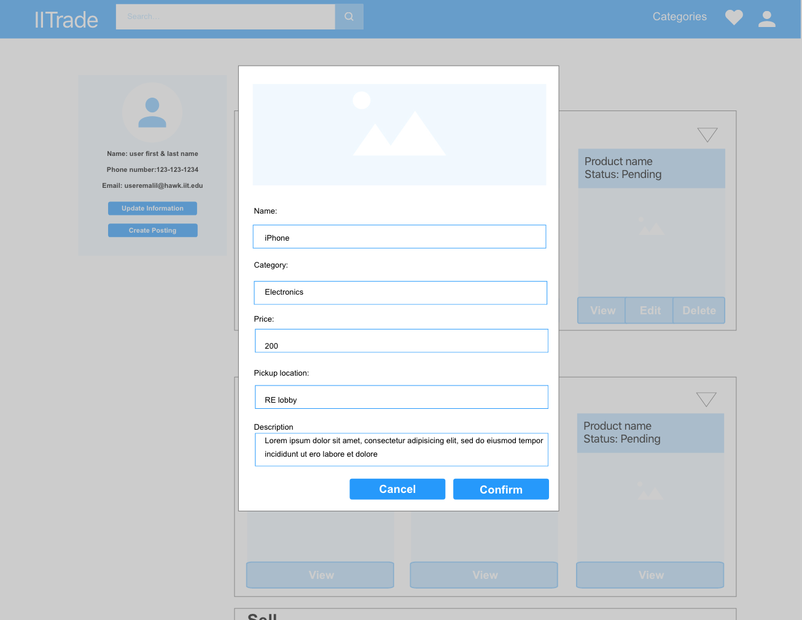
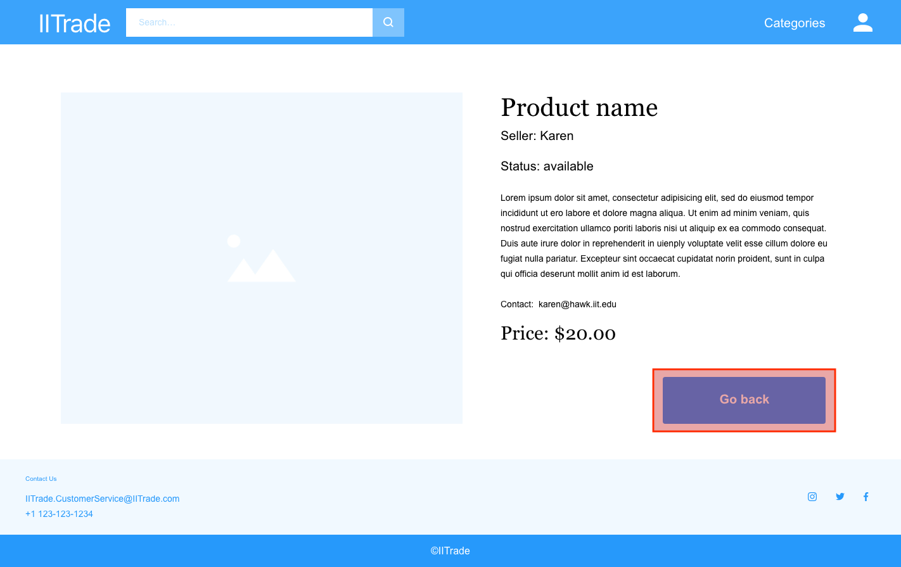
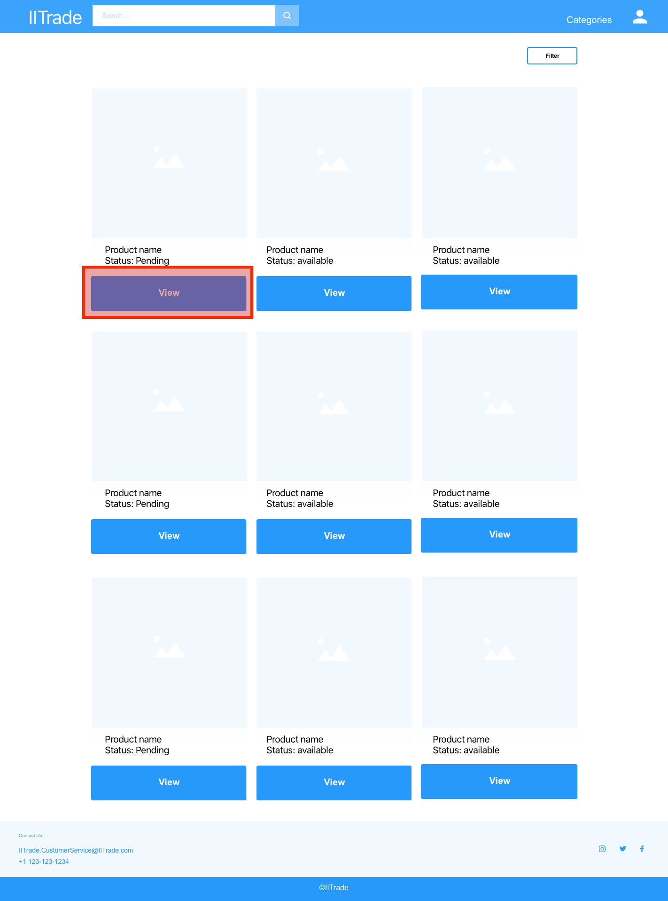
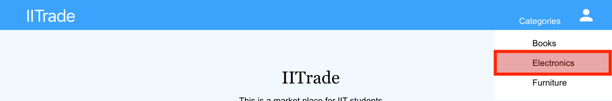
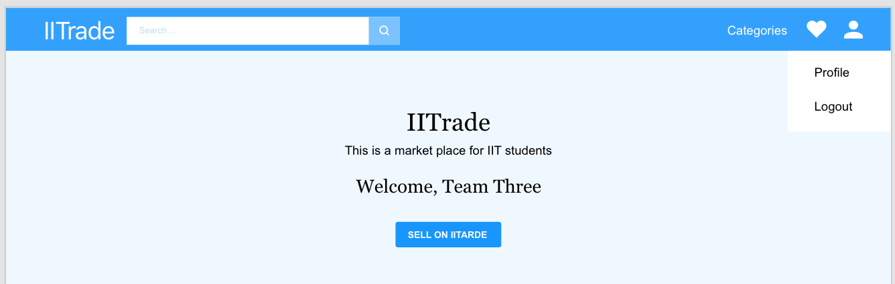

### Registered User Story

To be consider a User, I need to login with my username and password, if not, I need to sign up.

Since I am a first time user, I need to create an account with Name, Email, and Password, (all set fields) and SIGN UP.

Now as a registered USER, I can borrow the items, view details of item I want to potentially save and request

Now, I, as a **registered user**, am able to interact with the web application. I select VIEW to read more information about the item.

I am able to view information such as seller, contact information, item description, and price that are not displayed on the homepage. I then SAVE the item to my favorite list for consideration.

I am directed to the page where it lists all my favorites. I am not interested in buying one of the items anymore, so I REMOVE it from the list. I can SEND REQUEST to the seller

After submitting the request, I receive a request receipt with a confirmation number, information about the item and information about the seller. Once done reviewing the request, I go back to the main page by clicking on CONTINUE SHOPPING.

I access my profile page by clicking on the user icon and select profile on the drop down menu.

In my user profile, is the user informationa and lists of Posted Items, Purchased Items, and Pending Items. From the profile page, I create a new item by selectingc create item. 

When create an item, you will need to fill out a form in a dialog box and submit!

For the Posted Items List, I see one of my posted items has been requested by a potential buyer because the DENY and APPROVE buttons are enabled. This is under the assumption the buyer and seller have communicated transition details on their own through email (or chosen platform). Or I want to review the product information so I click on VIEW.

I also want to modify the information of another of my posted items. I type in new content in the input boxes and click on CONFIRM. I am able to modify the item information, but I decide to REMOVE it from listing. It will show that I have deleted the item on my profile in the currently selling. The options are view, edit, or delete. 

For Pending Items and Purchased Items, I am only able to view the details of the items. So I click on VIEW.

I view the details of an item and click on GO BACK when I am done. It takes me back to the profile page.

I am looking for something specific, so I input the keywords in the search box to SEARCH. I am able to find something related to the keyword, and I click on VIEW to check out the item information.

I search based on categories like books, electronics, etc. which the seller has categorized.

I am able to get the result, and I click on VIEW to check out the item information.

From the nav bar, I click on the HEART to check out all items that I have been saved. I am able to see all items, to request or remove. 

From the user drop-down menu, I click on LOGOUT to log out my account.