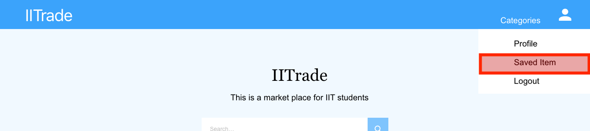

# Sprint-01 Report

## Team Number 03

- Project Manager: Wenwen Xie
- Developer: Minh Nguyen
- Jr. Developer: Nhan Nguyen
- IT Operations: Jessica DeJesus
- UI/UX Developer: Jianna Huang

## Sprint 1 Atomic Set Goals

- Define the purpose of Web Application
- Develop User Flow for different roles of application
- Discuss the User Story, Admin Story, and Anonymous story
- Research appropriate technologies React, Node.js, Express.js, MongoDB, desired API’s
- Research appropriate databases: MongoDB, MySQL
- Initialize project with fitting template to begin Web Application architect
- Produce UI/UX wireframe design for the application features and functionality

## UI/UX Report

IITrade aims to have a **user-centered** design and provide a **simple**, **user-friendly**, and **easy-to-use** website to the IIT community. Each element is structured in a consistent manner throughout the whole site. The design is subject to change throughout the semester based on team member decisions and feedback from potential users.

#### Layout
The navigation bar and footer appear on each page. They share the characteristics of simplicity, consistency, and clarity. The users are guided to information in a clear direction with minimal steps. Since IITrade is used to sell and buy items, information on the same item is grouped together in a grid. The buttons look clickable, and the size of the text is related to its importance and level of attention should be given.

#### Responsive website
The site will scale and respond based on screen sizes in order to make the site available for more devices. All images and text that are in a two-column layout or more will change to a single column layout for screen sizes below 600px in width. Text and images will be resized to more appropriately fit the user’s screen size. Padding and margins will decrease in order to provide correct spacing of content.

#### Font Family: Arial, Helvetica, sans-serif
These fonts are known as web-safe fonts which will appear the way they are cross platforms. They also make the text easy-to-read, since we have a description for each item to trade, it is better to use some readable fonts for paragraphs.

#### Main Colors: Blue and White
In psychology, the color blue is associated with dependability, security, and trust which matches the purpose of IITrade, to establish a safe and reliable environment for IIT people to trade with each other. White can be used in any type of website. Since IITrade users might upload images for each item to trade, it is better to use a clean background color and not distract users’ attention from the item images.

#### Features:
Post

This feature enables users to post an item for trade. All users will have a form in their profile page available. The form will consist of inputs for the item name, price, category, description, photos of the item, and location for pick up.

Request

This feature allows buyers to notify the sellers that they are interested in purchasing the items. Sellers have the ability to accept or deny requests.

Favorite

This feature allows users to save the items that they are considering but not necessarily buying, and it also allows users to compare prices for items from different sellers. They can send request or remove items from the saved item page if later they decide to purchase or not.

Search and Categorize

These two features make buyers’ experience more efficient. Since IITrade is for trading rather than shopping, we assume buyers will visit IITrade with specific items that they are looking for. So these two features save time in searching.

### Prototype

Adobe XD was used for prototyping because it is free and easy to use, and it creates shareable links to working prototypes without having viewers to create an account.

- [Student & Anonymous User Prototype](https://xd.adobe.com/view/22181273-b3a1-4ec6-468b-fc93ee266381-5429/?fullscreen&hints=off)
- [Admin User Prototype](https://xd.adobe.com/view/ca986dc9-8c86-435e-6fb8-0142eef0c0b8-bca9/?fullscreen&hints=off)

Comparable existing websites
- https://www.therealreal.com/
- https://www.facebook.com/marketplace/chicago/
- https://poshmark.com/category/Women
- https://www.etsy.com/

## Developer Report

As a team, we chose to use MERN fullstack(MongoDB, Express, React, and Node.js) JavaScript Framework to develop IITrade because these frameworks and technologies allow the web application to run cross-platform on any devices that have internet browser (mobile, tablet, and desktop), and it also allows us to build a fast and dynamic web application. All four allow an end-to-end framework for developers to work in. We also use Amazon S3 to store item images.

### Front-End
React is a library that allows a reactive user interface by having UI always rendering data, handle user input, and communicates with backend services. It is known for the fastest rendering of Virtual DOM and its reusable components. React also has Redux which manages the state of the entire application.
- Examples: Facebook, Instagram, Airbnb, Netflix, etc.

### Back-End
Node.js is a server-side runtime that listens to requests and sends responses, executes server-side logic, and interactive with the database and files. Node.js allows developers to create and split modules. It comes with a default packages manager npm which allows developers to install and manage third-party packages and their dependencies easily.
ExpressJS is a lightweight and fast web framework for Node.js. It simplifies the server-side coding process where routes and HTTP request specifications can be defined.
- Examples: Twitter, OpenTable, Accenture, etc.

### Data Storage
MongoDB is commonly used for store application data and secure connectivity. It is JavaScript-based and it stores data in JSON format which makes it easier to retrieve and manipulate within the Node/Express environment. It is also a schema-less and non-relational database.
- Examples: Cisco, Nokia, Google, Verizon, etc.

Amazon S3, Amazon Simple Storage Service, is a scalable, high-speed, and web-based cloud storage.
- Examples: Blackboard, Airbnb, etc.

## Junior Developer and Security Assumptions

Some security assumptions were made in regards to security, encryption, and authentication so far.

For security structure and configuration, standard users and administrator users should be identified and have different access levels to interact with the data from the database. Likewise, account information on standard users and administrator users should be placed in different tables within the database, and they should have different routes to sign in into IITrade. The purpose of this action is to protect admin information when the user information is hacked.

For authentication, only emails that are ended with hawk.iit.edu or iit.edu should be able to login to the web application since IITrade is developed for the IIT community only. There should be input validation in both client and server side to ensure data is passed correctly.

For encryption, since the user credentials are directly stored in MongoDB now, the passwords should be hashed using certain encryption methods before it is stored in the database. Data in transit is also considered. We should create a self-signed certificate for secure tunnel between client and server.

## IT Infrastructure Report

The operating systems used to develop a MERN application could be any modern version of macOS, Windows, or Linux. For example, Node.js is developed by and for Linux and macOS, primarily but Windows is also supported.

For client-side, we will use HTML, CSS, and Javascript, and in our case, with the dependencies of React. For the backend services, Node.js is used to interact with the database and files; therefore, no direct contact from the client to the storage layer. Encompassed by Node.js is Express.js which acts like a middle-ware that funnels requests through functions, includes routing, view-rendering, models, and so forth. Finally, for the storage layer, MongoDB is used to store documents in collections, and Amazon S3 service for our photo storage. Rather than storing the images directly in MongoDB with GridFS, we will store images there and store the assigned URLs in MongoDB.

For the database scheme, data formation is narrowed down to four main tables. User table stores information such as user id, name, login credentials, items they want to trade, and their favorite items. OneToMany relationship between User and Item: for a buyer, they can buy many items, but an item can only belong to one buyer; for a seller, they can sell many items, but items can not belong to many sellers. Item table stores information such as item id, date posted, item category, item price, item description, item status, and item photo URL. A user can opt to request an item, which will notify a seller one of their items have been requested. Request table stores information such as request id, FK user_buyer_id, FK  user_seller_id, FK item_id, and request status. There is a OneToOne relationship for Request to Item, there can be only one request per item and vice-versa. For buyer and seller (users), there is a OneToMany relationship from User to Request since the buyer/seller can have many requests but a request can only belong to one buyer and/or seller. Finally, we have a separate table for admin login credentials.

## User/Admin/Anonymous Story

As an IIT student(seller), I want to sell some of the items that I no longer use to other IIT students, so that I can make some money out of it and also help other students to obtain the item they need through a reduced price.

As an IIT student(buyer), I want to purchase used items from IIT student sellers, so that I can save money and have quick access to the item.

As an admin, I want to take down inappropriate content and users from our platform, so that IITrade can provide a better experience and a safe environment.

As an anonymous user, I want to have a sense of what products are available on the website before signing up, so that I don’t have to make an account if this is not the right website for me.

### User Flow Charts

They were created using Draw.io because it is accessible to all the team members through google drive.

Anonymous can only view the home page. After logging in, they have the same access as a registered user. Registered users have the roles as buyer and seller. Users can view all items and are able to post, update, delete items of their own. When a student (buyer) puts a request for an item, the other student (seller) can also approve or deny the request.

Admin has the ability to delete user profiles; for items, they will be able to delete any items that do not follow guidelines.

### Anonymous/Registered User Story

I, as an **anonymous user**, am able to see initial items on the homepage. When I click on an item to VIEW, I am directed to a login screen.

To be able to look at any item in detail, I need to login with my username and password or sign up.

Since I am a first time user, I need to create an account with Name, Email, and Password, and SIGN UP.

Now, I, as a **registered user**, am able to interact with the web application. I select VIEW to read more information about the item.

I am able to view information such as seller, contact information, item description, and price that are not displayed on the homepage. I then SAVE the item to my favorite list for consideration.

I am directed to the page where it lists all my favorites. I am not interested in buying one of the items anymore, so I REMOVE it from the list.

I want to trade/buy the item(s) in my list, I see two options to SEND REQUEST to the seller, I can send a request for all items simultaneously or per item. So I do not need to worry about cleaning up my list if I only want to request one of the items.

After submitting the request, I receive a request receipt with a confirmation number, information about the item and information about the seller. Once done reviewing the request, I go back to the main page by clicking on CONTINUE SHOPPING.

I access my profile page by clicking on the user icon and select profile on the drop down menu.

In my user profile, there are lists of Posted Items, Purchased Items, and Pending Items. From the profile page, I create a new item to sell by filling out the information and click on SUBMIT.

For the Posted Items List, I see one of my posted items has been requested by a potential buyer because the DENY and APPROVE buttons are enabled. This is under the assumption the buyer and seller have communicated transition details on their own through email (or chosen platform).

I want to review the product information so I click on VIEW.

I am able to modify the item information, but I decide to REMOVE it from listing.

I am directed to a page that indicates the item is removed. When I click on GO BACK, it takes me back to the profile page.

I also want to modify the information of another of my posted items. I type in new content in the input boxes and click on SAVE CHANGES.

For Pending Items and Purchased Items, I am only able to view the details of the items. So I click on VIEW.

I view the details of an item and click on GO BACK when I am done. It takes me back to the profile page.

I am looking for something specific, so I input the keywords in the search box to SEARCH.

I am able to find something related to the keyword, and I click on VIEW to check out the item information.

I search based on categories like books, electronics, etc. which the seller has categorized.

I am able to get the result, and I click on VIEW to check out the item information.

From the user drop-down menu, I click on SAVED ITEM to check out all items that I have been saved.

I am able to see all items, to request, remove, or request all items.

From the user drop-down menu, I click on LOGOUT to log out my account.

### Admin User Story

I receive a different login screen than standard users. I input my credentials and click on LOGIN.

I have the ability to view all users and delete profiles that are not following guidelines. I click on VIEW for one of the users.

I am able to view the items and their information posted by the selected user. Since one of the items is inappropriate, I click on REMOVE to delete it from the database.

I select ITEMS from the menu bar, it takes me to a page where it lists all items stored in the database.

I click on REMOVE to delete an item from the database.

I select LOGOUT from the menu bar to make sure my account is off.

## Atomic Goals for Sprint-02

Project Manager
- Goal setting and ensuring achievement of set goals for that 2nd sprint
  - Trello, Slack
- Prepare/document reports on web application
- Manage JIRA tracking tool

Developer
- Implement password hashing
- Implement IIT emails only authentication
- Implement frontend and backend validation for user input
- Implement a route for admin only
- Implement routes for Amazon S3 API

Jr. Developer
- Research appropriate technologies to secure data: Blowfish, HTTPS vs HTTP
- Research appropriate technologies for real-time communication: socket.io
- Research and create a self-signed certificate: X.509

IT Operations
- Implement artificial/seed testing data to test functionality of application
- Establish connectivity of Amazon S3 for photo storage
- Ensure all team members have initial code locally for production

UI/UX Developer
- Implement HTML and CSS to reflect UI/UX design
- Test responsive design
- Gather user testing feedback for a fluid UI

---

Resources

- https://github.com/PacktPublishing/Hands-on-MERN-Stack-Web-Development
- https://www.quora.com/Is-Windows-or-Apple-OS-preferred-for-Node-js-development
- https://blog.cloudboost.io/creating-your-first-mern-stack-application-b6604d12e4d3
- https://www.apress.com/gp/blog/all-blog-posts/why-mern/12056000
- https://medium.com/@paulrohan/file-upload-to-aws-s3-bucket-in-a-node-react-mongo-app-and-using-multer-72884322aada
- https://dba.stackexchange.com/questions/119271/storing-files-on-mongodb
- https://www.freecodecamp.org/news/how-to-set-up-simple-image-upload-with-node-and-aws-s3-84e609248792/
- https://websitesetup.org/web-safe-fonts-html-css/
- https://99designs.com/blog/creative-inspiration/psychology-color-web-design/
- https://webflow.com/blog/web-page-layout-101-website-anatomy-every-designer-needs-to-learn
