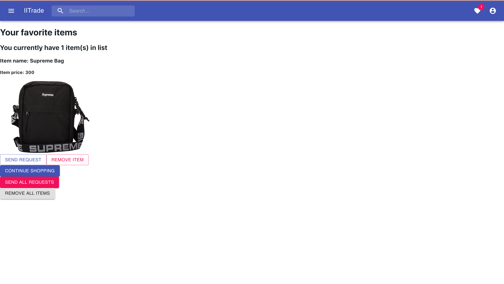

# Sprint-02 Report

## Team Number 03

- Project Manager: Jianna Huang
- Developer: Nhan Nguyen
- Jr. Developer: Minh Nguyen
- IT Operations: Wenwen Xie
- UI/UX Developer: Jessica DeJesus

## Sprint 2 Atomic Set Goals

- Project Manager
  - Goal setting and ensuring achievement of set goals for that 2nd sprint
  - Prepare/document reports on web application
  - Manage JIRA tracking tool
  - Creating goals for sprint 3
- UI/UX Developer
  - Gather user testing feedback for a fluid UI
  - Implement HTML and CSS to reflect UI/UX design
  - Test responsive design
- Developer
  - Implement password hashing
  - Implement IIT emails only authentication
  - Implement frontend and backend validation for user input
  - Implement a route for admin only
  - Implement routes for Amazon S3 API
- IT Operations
  - Create a script to implement seed data
  - Implement at least 15 artificial/seed testing data to test the functionality of the application
  - Establish connectivity of Amazon S3 for photo storage
  - Ensure all team members have initial code locally for production
- Jr. Developer
  - Research appropriate technologies to secure data: Blowfish, HTTPS vs HTTP
  - Research appropriate technologies for real-time communication: socket.io
  - Research and create a self-signed certificate: X.509

## UI/UX Report

#### Gather user testing feedback for a fluid UI

We tested the first UI/UX design using our prototype created with Adobe XD on 5 of our friends. We decided to make some minor changes to enhance the user experience by reducing steps that lead to the main functions and giving more clear information and direction.

#### New Changes

We would like to greet the users in the main spot of the homepage, and also let them know which user account they are logged in as.

When posting an item for sale, users are now able to access this function through the main page. They do not need to click on the icon on the navigation bar to access their portfolio through the drop-down menu, which minimizes the steps that take users to this IITrade’s main function with a more straightforward label.

The Favorite Item page was original access through the drop-down menu under the person icon. It is now separated and has its own heart icon for representation.

They are renamed from “Save” to “Favorite”, and “Saved Items” to “Favorites” which match the representation of the heart icon.

#### Implement HTML and CSS to reflect UI/UX design

Instead of coding all HTML and CSS from scratch, we decided to use three react templates gathered from material-UI as a starting point in order to enable faster development. The HTML and CSS were implemented in the javascript files.

Signup page

Sign in page

Main page showing current selling items, and navigations for selling items, search, saved items list, save the item into the list and the dropdown menu for student information, item information, and logout.

Student account information page to display student information such as name and contact information.

The student profile page for viewing items sold, items bought, currently selling, and posting items.

Item description page that displays information about the item and allows the user to save the item.

The favorite items page for students to save items and checkout.

The item posting form displayed after pressing *create posting* in the profile page or pressing *sell something* in the main page.

Example of HTML and CSS
All HTML and CSS code are written within the javascript files.

#### Test responsive design

As for the responsive design in the current sprint, any content with more than 2 columns will be changed into one column when seen in a smaller screen. For example, our images are formatted in 3 columns for default but when the screen is viewed in a mobile scale, it will only show all images in one column.

## Developer Report

#### Implement password hashing

When the user enters the password when registering, the app will use Blowfish encryption algorithms along with salt to hash the passwords. After it is being hashed, it is stored in the mongo db database.

#### Implement IIT emails only authentication

In the registration validation, a if statement is added to validate whether an email address ends with hawk.iit.edu. If the email does not end with hawk.iit.edu, an error will appear in the back-end and the user will not be able to register.

#### Implement front-end and back-end validation for user input

As for now, only back-end validation is being implemented for user registration and login. For registration, it will check if the user entered a name; the user left the email input empty or whether the email address is a hawk email or not; the password entered is at least 6 digits; the password entered matches with the password confirmed; the phone number field is not empty. For login, it will check whether the email and password fields are empty or not and it will also check whether the entered inputs match with those in the database. As for no here is no front-end validation.

#### Implement routes for Amazon S3 API

Amazon S3 API was implemented in order to store images into the amazon S3 server. Once the image is stored in the Amazon S3 server, it will provide a link to the Mongo DB so that we are able to access the images through Mongo DB and display them through the site.

## IT Infrastructure Report

#### Changed Initial Database Schema

Restructured No SQL Database Mongo DB Schema

Normalized Data Model - Document References

In the database schema, document references show our normalized data model describing references between documents for a USER, ITEM, and REQUEST. To avoid the repetition of information with embedded documents, there will be different collections of information for all three entities. For the USER collection, a user's basic information will be stored. For an ITEM collection, we will store all the details of an item. Alongside the item details, the one-to-many relationship of a user_seller, one-to-many user_buyer, and the many-to-many relationship for user_favorited_by items for a user will be stored per item. This will eliminate the need for rendering several API of items and users when information needs to be retrieved. For the REQUEST collection, a one-to-one relationship is established between an item and request where there can be only one request per item and vice versa.

#### Implement artificial/seed testing data to test the functionality of the application

In order to generate data, we are using Python and written programs to generate data, then it will store user data as a dictionary. Generated user data includes full name, email, phone, and password.

To generate a user full name (def rand_name in line 45), we will use a wordlist (word_url in line 35). The function will open the URL and pick a random name from that word list.

Each user will have different password also following password requirement for security:

- Password must at least 6 characters
- Must have at least one uppercase character
- Must have at least one lowercase character
- Must have at least one special character
- Must have at least one number

To generate passwords, we declare the variables (line 23 to 27) to fulfil the password requirement. And in line 52, it will combine all the requirements to create a secure password.

To generate the data, in line 50, we are going to generate 20 users including their information (full name, email, phone, and password). For each time the script generates one user, it will append to user_data (line 56 to 59).

From line 74 to 76, we are outputting the user data into CSV file. Only admin users with certain privileges can run the script and have the data saved in the database otherwise, it will only generate a CSV file with 15 sets of user data.

Example of code

We have generated a minimum of 15 users to our database, it is currently populated to be used in our application.

#### Establish connectivity of Amazon S3 for photo storage

The connectivity to the Amazon S3 server was successfully established through the use of a generated access key.

The iitrade.item bucket is used similarly as a file folder that contains objects. The images stored in the bucket are images of items uploaded by the sellers.

Inside the bucket contains the image saved as data and its description such as date modified, size, and storage class.

A access key was created and implemented in the code in order to be able to use and access the Amazon S3 server.

Ensure all team members have initial code locally for production

## Junior Developer and Security Assumptions

#### Research

Blowfish

Blowfish is a free symmetric encryption algorithm developed by Bruce Schneier. It has a block size of 64-bit and key sizes from 32 to 448 bits. It mainly has two stages: the 16 iterations of the round function stage and the output operation stage. Because of its small number of iteration rounds and its simplicity due to fewer modular additions and exclusive-ors, it is comparatively a fast block cipher. One downside of Blowfish is it is vulnerable to birthday attacks because of its small block size.

HTTPS vs HTTP

HTTP (Hypertext Transfer Protocol) is a protocol used in early websites that allows for communication across systems. It is used for transferring data from a server to a user’s web browser.

HTTPS (Hypertext Transfer Protocol Secure) is a protocol used in current websites that allows for a more secure communication across systems. Just like HTTP, it is used for transferring data from a server to a user’s web browser. HTTPS uses a SSL (Secure socket layer) certificate to encrypt connections between systems, thus protecting the data being transferred.

The main difference between HTTP and HTTPS is the SSL certificate that encrypts the data during the transmission which makes HTTPS more secure.

Socket.io

Socket.io is a JavaScript library for web-applications that allows real-time transmission of data from a server to a browser and vice versa. It can be used by any platform, web browser and device. It has two sides: a client-side library and a server-sides. The client-side runs in the browser while the server-side is for Node.js. Socket.io can provide real-time analytics, binary streaming, real-time messaging, and document collaboration. It is a library that can be seen used by Microsoft office, yammer and Zendesk.

Certificate: X.509

X.509 is a standard format of a public key certificate. It is used for ensuring privacy and legitimacy of a web-application, individual, or organization to prevent personal data from getting stolen. It is useful for users when identifying secure connections. The X.509 contains a public and an identity of the user linked to the certificate. A X.509 can be self-signed or signed by an authority.

Salt

Cryptographic salt is made up of random bits added to each password instance before its hashing. Salts create unique passwords even in the instance of two users choosing the same passwords which is useful for avoiding cryptographic attacks.

#### Implementations

Implement passport-jwt

The application uses passport-jwt strategy to authenticate legitimate users to specific routes.This strategy verifies request header if it contains an authorization token.

HTTPS

It was decided to implement HTTPS into the application for more secure communication across systems. The app uses HTTPS to transport encrypted data, providing a more secure tunnel between client and server.

X.509 certificate

A certificate X.509 was created using OpenSSL library to encrypt online data communications between an end-users browser and a website. This provides more reliability to the website and creates a more secure connection.

## Atomic Goals for Sprint-03

- Project Manager
  - Goal setting and ensuring achievement of set goals for that 3nd sprint
  - Prepare/document reports
  - Manage JIRA tracking tool
  - Resolve GitHub Issues
  - Create goals for sprint 4
- UI/UX Developer
  - CSS for Pages SignUp.js and Home.js
  - Create front-end validation for user login, sign-up, and item posting
  - Create a user account management page (EDIT Page)
  - Create front-end for admin route using templates
  - Continue to implement responsive design to admin route and student user route
- Developer
  - Implement front-end validation for user login, sign-up, and item posting
  - Ensure CRUD functionality and testing for USERS, ITEMS, and REQUEST for admin
  - Ensure CR functionality for REQUEST for a user
  - CRUD for USERS and ITEMS functionality for a user
  - Implement delete route for Amazon S3 objects
- Jr. Developer
  - Research an appropriate load balancer
    - https://www.digitalocean.com/community/tutorials/what-is-load-balancing?
  - Implement socket.io
  - Add additional validations requirements for collections
  - Create back-end for Admin route
  - Assist developer with CRUD functionality for admin and users
- IT Operations
  - Begin to research automation of application deployment
  - Research for potential memory caching technologies
  - Research Memcached for the memory caching layer
  - Research Replication in MongoDB -- Datastore makes use of master/slave replication https://docs.mongodb.com/manual/replication/
  - Restructure script to delete data and repopulate it for 15 users seed data

## Resources
https://docs.mongodb.com/manual/tutorial/model-embedded-one-to-many-relationships-between-documents/
https://docs.mongodb.com/manual/core/data-model-design/
https://docs.mongodb.com/manual/tutorial/model-referenced-one-to-many-relationships-between-documents/#data-modeling-publisher-and-books
https://www.commonlounge.com/discussion/d95616beecc148daaa23f35178691c35#blowfish-round-function
https://seopressor.com/blog/http-vs-https/
https://socket.io/docs/
https://www.sslauthority.com/x509-what-you-should-know/
https://docs.mongodb.com/manual/administration/security-checklist/
https://material-ui.com/getting-started/templates/?fbclid=IwAR02IzMb3xs4UKCLwZzBWoJCA485T63p5rJsctKL5x9vmWvLaYj_Xb9cOoQ
https://docs.mongodb.com/manual/tutorial/model-referenced-one-to-many-relationships-between-documents/#data-modeling-publisher-and-books
https://docs.mongodb.com/manual/core/data-model-design/#data-modeling-referencing
