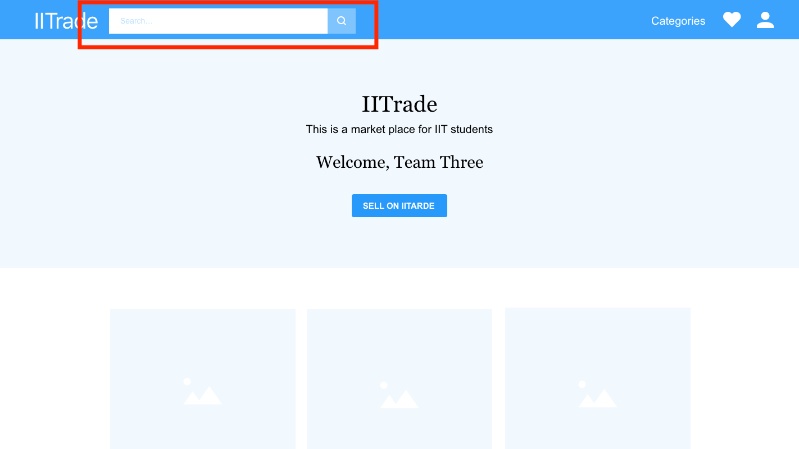
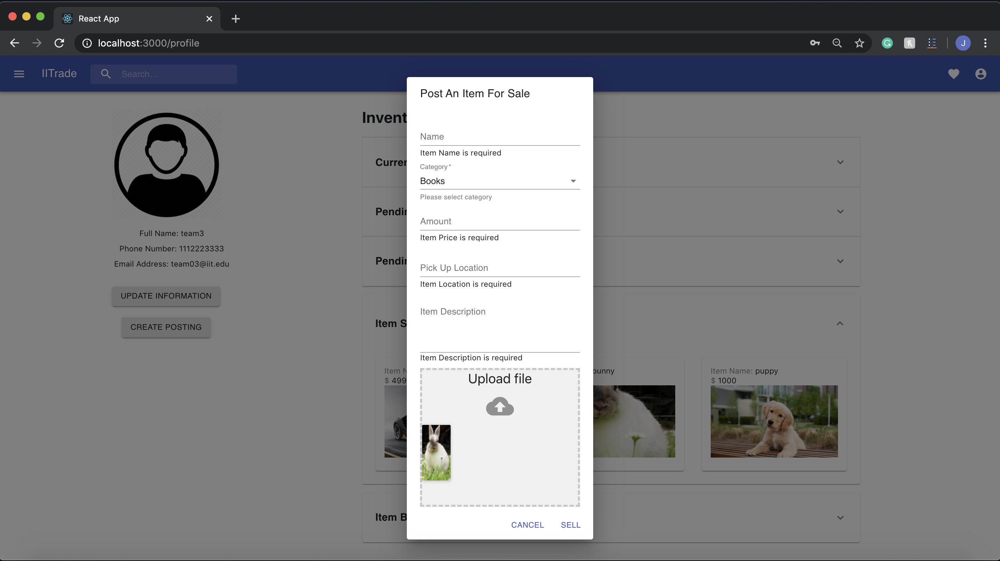
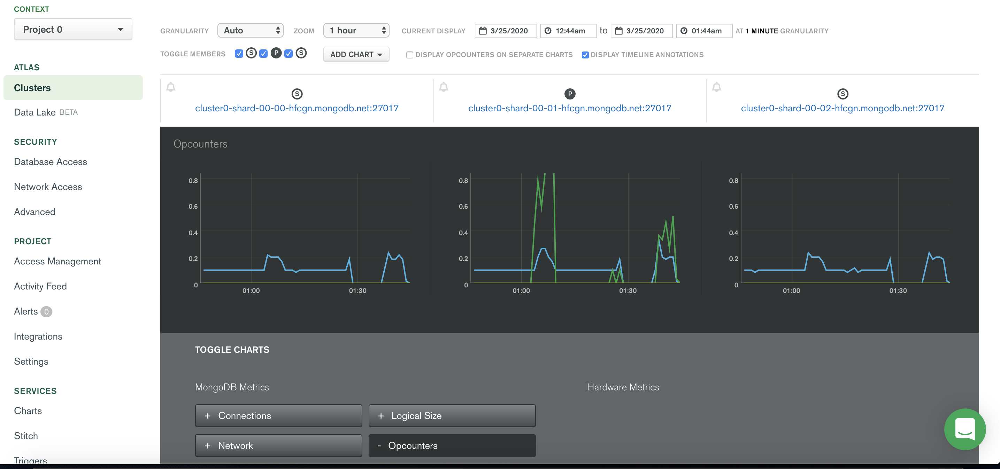
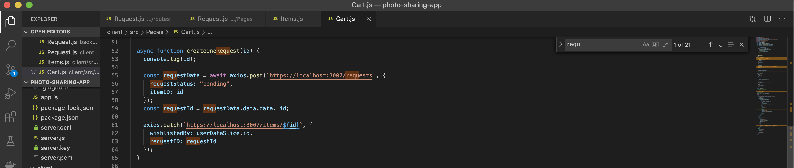

# Sprint-03 Report

### Team Number 03

- Project Manager: Jessica DeJesus
- Developer: Wenwen Xie
- Jr. Developer: Jianna Huang
- IT Operations: Minh Nguyen
- UI/UX Developer: Nhan Nguyen

## UI/UX Artifacts

#### Markdown documents with Stories
1. user-story.md - https://github.com/illinoistech-itm/2020-team03r/blob/master/diagrams/user-story.md 
2. admin-story.md - https://github.com/illinoistech-itm/2020-team03r/blob/master/diagrams/admin-story.md 
3. anon-story.md - https://github.com/illinoistech-itm/2020-team03r/blob/master/diagrams/anon-story.md

Jira Board: https://iltechsat.atlassian.net/secure/RapidBoard.jspa?rapidView=22&selectedIssue=TEAM03-45 

#### CSS for Pages SignUp.js and Home.js
- CSS for SignUp page

    We used the UI Materials to get a standard layout of a Sign Up page. This is the final layout and fields that we will require a user to enter when signing up. 

    

    

- CSS for Home page

    We used UI Materials to get our items listed in rows of 3. This will be our final design for the hompage. Also, as reported in the last sprint, we are displaying the USER's name on the front of the page. This will let them know they are logged in. But we decided to keep the search bar on the top so users at all times are able to search items. 

    Alter UI/UX design to reflect search bar moved to top left corner:

    

    Current state of the application using UI materials. 
    
    

#### Create front-end validation for user login, sign-up, and item posting

We have set front-end validation for when users are sign-up, logging in, and creating an item posting. Will display appropriate error messages. 

- Login Validation

    For login, validation must have all fields are not empty. The email must follow REGEX formatting and must be a Hawk Email. 

    

- Sign-Up Validation

    For sign-up, validation must have all fields not empty. The email must follow REGEX formatting and must be a Hawk Email. For passwords, the password and re-entrying password must match. You can not sign-up with an email that already exist. 

    

- Item Posting Validation

    For item posting, validations must have all fields not empty. Currently working on photo validation. 

    

#### Create a user account management page (EDIT Page)
To create a manageable site, the account management will be located in the profile of the USER. This section will reflect the USERs information. There will also be an update button to edit USER information like password or phone number in another page. 

Altered UI/UX design to reflect user account information in combination with user profile.

Current state of the application with user information.  

Altered UI/UX design to reflect user account information in combination with user profile.

The function to update user information has been implemented. You need to unlock the field to edit and it will provide an empty field to now change/update. We can currently working on the updating password, to ensure proper password protection.  

#### Create front-end for admin route using templates

We have used UI Material to format admin login to be standard. For admin tables, we used UI Material Tabs make it easy to explore and switch between different views of USER, REQUEST, and ITEM data.

Altered UI/UX design to reflect desired login management page for admin

Current state of admin login management page

Github Commit - https://github.com/illinoistech-itm/2020-team03r/commit/86de3223e8d926558fe0997121e5f826dcef17b1 

#### Design for admin route

Admin
- Dialog pop-ups for updating, deleting, and view data. There are dialog pop-up for all tabs and all functions. 

Github Commit - https://github.com/illinoistech-itm/2020-team03r/commit/7a7af408c5ce0112cfe1286493c3c9a4003b2829 

Github Commit - https://github.com/illinoistech-itm/2020-team03r/commit/05b0fcd8a14c89bd4a037f2c56fca0322a40a61b 

#### Mobile Responsive Design

Ffrom Material UI, we have newly introducted Expansion boxes, it is still mobile responsive for USERs to use on a variety of screen types. 

Displaying mobile friendly USER profile

## Infrastructure
#### Begin to research automation of application deployment
Plans to begin "testing and productioning environments after sprint 03" .

Ensure one team member has gone through vagrant and packer tutorials. All teams are actively completing the process of automation using packer and vagrant. We will run/test the code on a Linux Server, we will use vagrant and packer Build the Virtual Machines for production. 

#### Research for potential memory caching technologies
For our memory caching layer, using npm to install a mongoose-cache-manager. For such a caching layer, we could potentially store to be able to use an existing mongoose connection that we have already established in our application. By default mongoose-cache-manager will use the memory store to cache queries from data being retrieved. 
For example, for our custom build models, in mongoose.Schema, we can cache down to a model objects, like the for the information of ITEMS, etc. 

Resource Link: https://github.com/disjunction/node-cache-manager-mongoose

#### Research Replication in MongoDB
For our MongoDB database, we have Three Member Replica Sets. Our three member replica set can have the recommended three data-bearing members (Primary-Secondary-Secondary).
 
These deployments provide two complete copies of the data set at all times in addition to the primary. These replica sets provide additional fault tolerance and high availability. If the primary is unavailable, the replica set elects a secondary to be primary and continues normal operation. The old primary rejoins the set when available.

For when the client application is in use, the client application can interact with the primary node, and after that, it will create replication in the following nodes. 

We have set our readPreference=secondaryPreferred. In most situtations, secondary will handle all operations read from the secondary members of the replica set. But as back up for if no secondary members are available, operations read from the primary.

Here are our three replica set. Cluster can detect read and write operations from MongoDB cloud management. 

Altered the read perference for MongoDB cluster collection

Github commit - https://github.com/illinoistech-itm/2020-team03r/commit/53afbb0b0813baa2b17e10cbf0dd12e47e300324

#### Restructure script to delete data and repopulate it for 15 users seed data
Assumptions: We currently have a python script that populated 15 real users into our database. All the users are currently there and able to use. Our next goal is to generate real ITEMS alongside those users. 

## Developer
#### Implement front-end validation for user login, sign-up, and item posting
Implementation of our validation form checks if the fields are fullfilling requirements. Within the function of submitting the data. For example, registering a user, it will run it through validateForm and if they do not meet the requirements, then it will display an error message. Backend has the same validations as the frontend for all field requirements. 

Snippet of ValidationForm and function for SignUp

Git Commits for:
- User login: https://github.com/illinoistech-itm/2020-team03r/commit/61d3f9326168dda396b9b46055d47c5b55730da9 
- Sign-up: https://github.com/illinoistech-itm/2020-team03r/commit/6b439a758e81ae1ffa0abc8f06a7df253e2735c4 
- Item Posting: https://github.com/illinoistech-itm/2020-team03r/commit/9cc30b4d19eb0de788abc3f75c684d16246740c7 

In addition, we added validation for admin login. This would show whether the admin is entering the correct credentials. 
Git commit: https://github.com/illinoistech-itm/2020-team03r/commit/3bea43050d55be15045b582e0c1dbe0e7799319c 

#### Ensure CRUD functionality and testing for USERS, ITEMS, and REQUEST for admin
We have given admin the ability manage all data from the database concerning user data in the application. For the user information, the admin can view, update and delete any user. For updating user information, fields will need to be unlocked to edit user information. For ITEMS, they are able to view and delete. Finally, for request, they are able to view and delete also. 

The following is a snippet from the updating function where USER inform will get retrieved and edited. 

Github commit - https://github.com/illinoistech-itm/2020-team03r/commit/7a7af408c5ce0112cfe1286493c3c9a4003b2829
Git commit: https://github.com/illinoistech-itm/2020-team03r/commit/7fdbcf4aa15e014936f2cca06bcce91fefc17e21 

#### Ensure CRD functionality for REQUEST for a user
A USER can request an item after they have added it as a favorite for that shopping period. After they have requested it, the item will appear in thier Profile under their pending buys. For the Buyer, it will appear under the pending buy to only view or cancel. For the seller, it will appear under the pending sell, where the seller will have the ability to APPROVE, DENY, OR CANCEL. As of now, we have APPROVE and CANCEL functioning. We hope to enchance our application by having DENY as a function in which the requester can no longer see the posting, therefore, the DENYing means that they are blocked from ever being able to request it again. As of now, cancel simply cancels the request and puts it back up for selling. Also, the item is removed from the marketplace so other buyers can no longer request it. 

The following is a snippet of cart being our favorite, where a buyer will have to request from. 

The options presented to buyer for the items they have requested

The options presented to a seller for the items that have been requested

After items have been sold or bought, a history of items will be shown as below: 

Git commit for complete send, approve and cancel requests - https://github.com/illinoistech-itm/2020-team03r/commit/bb258162fa8ae146a227e43f3833a7ceeedfe69c 
Git Commit - https://github.com/illinoistech-itm/2020-team03r/commit/d48ccf9c55978b33d9124be6caafb3fedd4ed79f

#### CRUD for USERS and ITEMS functionality for a user

A USER can create an ITEM to sell from thier profile. It will be assigned to them and post on home for the selling. 

You can also delete and update the ITEM information the the USERs profile

Functionality for ITEM CRUD in Item Controller

Github Link: https://github.com/illinoistech-itm/2020-team03r/blob/master/code/photo-sharing-app/backend/api/controllers/itemsController.js 

#### Implement delete route for Amazon S3 objects
When we delete item, we want to ensure the delection of images in our Amazon Service. Before, we were able to delete the item from MongoDB, but it did not delete the image in AWS. Now, it will ensure that deleteRecursive will happen when item is deleted. We have now implemented that when a user deletes an item, the photo that was stored is also now deleted. 

Following snippet is displaying API/Controller/imageController where a function has been created that an image will get deleted from the AWS account when an item is deleted/no longer exit. There was no need to still store the image and up storage if it was no longer needed. 

Github commit - https://github.com/illinoistech-itm/2020-team03r/commit/1d6d204eed235e83a41443b224772c1d75ead275 

## Jr. Developer
#### Research an appropriate load balancer
For our database MongoDB, load balancing can be dealt with by using replication. MongoDB replication can be used to handle more traffic from clients and to reduce the load on the primary server, like in our Three Member Replica Sets. For our application, we will/have instructed USERS to read from secondaries server instead of the primary server. This can reduce the amount of load on the primary server as all the read requests coming from clients will be handled by secondary servers. Therefore, the primary server will only take care of write requests. For the most part MongoDB can handle concurrent requests by itself, there is no need to add a load balancer in your MongoDB cluster.

Resource Link: https://severalnines.com/database-blog/overview-mongodb-and-load-balancing 

#### Implement socket.io
We will not be implementing socket.io. We had initalize wanted to have some type of chat room/messaging option. But, with time constraints and abilities of our team, we have choosen to not utilize socket.io. 

#### Add additional validations requirements for collections
Additonal validations have been added to password and email. Backend has password length and email for offical hawk account validation. Frontend has regex for password regex validation for must contain at least 1 lowercase alphabetical character, least 1 uppercase alphabetical character, at least 1 numeric character, at least one special character, and string must be eight characters or longer. 

Frontend validation

Backend validation

Github commit - https://github.com/illinoistech-itm/2020-team03r/commit/7f1605ee8c242d39a37d8f49dc0ca4667281dfb6 

#### Create backend for Admin route
We have create a different route for admin to login! Admin will be redirect to an management page in which the admin can login. 
We added an additional Admin route. As states before, the admin has the ability to view all data. They can delete, update, and view USERS, ITEM, and REQUEST. 

To access the admin side, you need to go to /admin which will redirect you to the /management page to login in as admin. You need the admin email, password, and access code

Admin route and in App.js, new /admin route to access data

Github commit - https://github.com/illinoistech-itm/2020-team03r/commit/3d9e193a1bc607011df20d93fd944c9e0ad5a6c5 

#### Assist developer with CRUD functionality for admin and users
As stated in the developer section, we have given admin the ability manage all data from the database concerning user data in the application. 

For ITEM updating, snippet of functionity from USER profile. 

Github commit - https://github.com/illinoistech-itm/2020-team03r/commit/7a7af408c5ce0112cfe1286493c3c9a4003b2829

Git commit: https://github.com/illinoistech-itm/2020-team03r/commit/7fdbcf4aa15e014936f2cca06bcce91fefc17e21 

#### GitHub issues/bugs reported and assigned

Issues #1 https://github.com/illinoistech-itm/2020-team03r/issues/37 

Issues #2 https://github.com/illinoistech-itm/2020-team03r/issues/39 

Issues #3 https://github.com/illinoistech-itm/2020-team03r/issues/41

Issues #4 https://github.com/illinoistech-itm/2020-team03r/issues/42

Issues #5 https://github.com/illinoistech-itm/2020-team03r/issues/70

All issues have been addressed and commented with commit link that corrected/addressed the issue. 

Alterations to User Story:

1. Add Expanison Panels to User profile for Currently Selling, Pending Sell, Pending Buy, Item Sold, and Item Bought. 

UI/UX Reflection

Current State: 

2. Item Creation in Dialog Box 

UI/UX Reflection

Current State: 

3. Admin Dialog Boxes for Updating, creating, and deleting

UI/UX Reflection

Current State: 

Changes are reflecting in User Story: https://github.com/illinoistech-itm/2020-team03r/blob/master/diagrams/user-story.md

Changes are reflecting in the Admin Story: https://github.com/illinoistech-itm/2020-team03r/blob/master/diagrams/admin-story.md 

Assumption: Any uncompleted work within the goals of Sprint 03 are to be continued and refined for Sprint 04.  

## Atomic Goals for Sprint-04

- Project Manager
  - Goal setting and ensuring achievement of set goals for that 4th sprint
  - Prepare/document reports
  - Manage JIRA tracking tool
  - Resolve GitHub Issues
  - Create goals for sprint 5

- UI/UX Developer
  - Confirm message - snackbars
  - Enchance front-end validation application - color, formatting
  - Request receipt
  - View Item presentation format
  - Progress indicators UI materials for LOGIN, REQUEST, and ITEM posting
  - Continue to implement responsive design to admin route and student user route

- Developer
  - Implement Update for USER password
  - Implement DENY for REQUESTs between USERS
  - Create search functionality for ITEMs
  - Admin creation/sign up
  - Retrieve SELLER and USER emails for Request receipts
  - Database Dump
  
- Jr. Developer
  - Photo validation
  - Login validation - email already exist
  - Associate request to USER and SELLER
  - Assist with refining REQUEST CRD functionality between USERS
  - Assist developer refine CRUD functionality for USERS, ITEMS, and REQUEST for admin

- IT Operations
  - Begin automation of application deployment
  - Apply mongoose-cache-manager for caching layer
  - Ensure correct set up for Replication in MongoDB database with our three member replica set
  - Script to populate seed data for ITEM
  - Test and Production environments will be built

