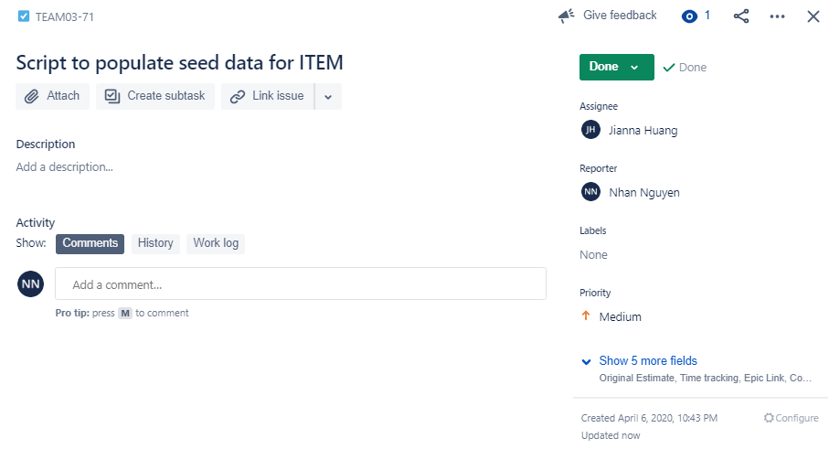
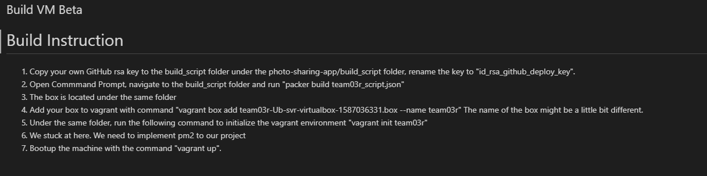

# Sprint-04 Report

### Team Number 03

- Project Manager: Nhan Nguyen
- Developer: Jessica DeJesus
- Jr. Developer: Wenwen Xie
- IT Operations: Jianna Huang
- UI/UX Developer: Minh Nguyen

## Sprint 4 Atomic Set Goals

- Project Manager
  - Goal setting and ensuring achievement of set goals for that 4th sprint
  - Prepare/document reports
  - Manage JIRA tracking tool
  - Resolve GitHub Issues
  - Create goals for sprint 5
- UI/UX Developer
  - Confirm message - snackbars
  - Enchance front-end validation application - color, formatting
  - Request receipt
  - View Item presentation format
  - Progress indicators UI materials for LOGIN, REQUEST, and ITEM posting
  - Continue to implement responsive design to admin route and student user route
- Developer
  - Implement Update for USER password
  - Implement DENY for REQUESTs between USERS
  - Create search functionality for ITEMs
  - Admin creation/sign up
  - Retrieve SELLER and USER emails for Request receipts
  - Database Dump
- Jr. Developer
  - Photo validation
  - Login validation - email already exist
  - Associate request to USER and SELLER
  - Assist with refining REQUEST CRD functionality between USERS
  - Assist developer refine CRUD functionality for USERS, ITEMS, and REQUEST for admin
- IT Operations
  - Begin automation of application deployment
  - Apply mongoose-cache-manager for caching layer
  - Ensure correct set up for Replication in MongoDB database with our three member replica set
  - Script to populate seed data for ITEM
  - Test and Production environments will be built


## UI/UX Artifacts

#### Markdown documents with Stories
1. user-story.md - https://github.com/illinoistech-itm/2020-team03r/blob/master/diagrams/user-story.md
2. admin-story.md - https://github.com/illinoistech-itm/2020-team03r/blob/master/diagrams/admin-story.md
3. anon-story.md - https://github.com/illinoistech-itm/2020-team03r/blob/master/diagrams/anon-story.md

Jira Board: https://iltechsat.atlassian.net/secure/RapidBoard.jspa?projectKey=TEAM03&rapidView=22

#### Confirm message - snackbars
- Artifacts Screenshot:
  1. Github commit: https://github.com/illinoistech-itm/2020-team03r/commit/b4455c88e3a09604fb86a2ed69d5fcf5dab52a90

  2. Project Management:

    

- Snackbars:

  We implement snackbars to inform users of a process that an app has performed or will perform. The snackbar information the users that their item is saved to their Favorite after users clicked "save"

  

  They appear temporarily, towards the bottom of the screen. They shouldn’t interrupt the user experience, and they don’t require user input to disappear. They automatically disappear from the screen after a minimum of six seconds.

  

#### Enhance front-end validation application - color, formatting
- Artifacts Screenshot:
  1. Github commit: https://github.com/illinoistech-itm/2020-team03r/commit/57283b194844b9169093e1b1b1eca0aa93725e3f

  2. Project Management:

    

- Enhance color and formatting for validation errors:

  We want to enhance message errors in login and signup form, making it more accessible and more convenient to use. Hence, a better display hints appear when the users enter invalid information. 

  1. SignUp Page:

      - Old-version

          

      - New-version

          

  2. Login Page:

      - Old-version

          

      - New-version
      
          

#### Request receipt
- Artifacts Screenshot:
  1. Github commit: https://github.com/illinoistech-itm/2020-team03r/commit/ddcabd4a7cdf3e8c6289902f8b09c213553abbc5

  2. Project Management:
  
       

- Design of Request Receipt page

    This will inform users that their interested item is in pending buy after they send the request to seller. A read receipt confirms that your request was proceeded/sent to seller successfully. 

    Alter UI/UX design to reflect Request Receipt page

      

    Current state of the application with Request Receipt page.

      

#### View Item presentation format

- Artifacts Screenshot:
  1. Github commit: https://github.com/illinoistech-itm/2020-team03r/commit/885a3c20a5a0ac53e684712a568c42ff101d8dbf

  2. Project Management:
  
       

- Product Page:
  
  There are many steps to ecommerce success, from high quality products to a beautiful landing page, but one of the most important ingredients is a well designed product page. The main purpose of any product page is to persuade customers to add the product to their basket, and then complete the purchase.

  Even though our site is tend to be a third-party to held a deal, but with enhance product page we can increase more chances for sellers to close the deal.

  Alter UI/UX design to reflect how item presenting its information

  

  Current state of the application to view item information
  
  

#### Progress indicators UI materials for LOGIN, REQUEST, and ITEM posting
- Artifacts Screenshot:
  1. Github commit: https://github.com/illinoistech-itm/2020-team03r/commit/e13b4b16c509b1cc518370b5fb9f9c1b2d56ea4c

  2. Project Management:
  
       

- Admin Page:

  Process Indicator is used to indicates the progress for determinate and indeterminate processes. We have implement a circle progress indicator Admin login page.

  

  

  We need to continue implement this to Request and Item posting. This can be a goal for sprint 5


## Developer
#### Implement Update for USER password

- Artifacts Screenshot:
  1. Github commit: https://github.com/illinoistech-itm/2020-team03r/commit/99ab53a6d8a2a23e56a259672b8be92d81e6ddd1

  2. Project Management:
  
       


- Update User password with hash:

  When developing websites or web applications it is important to always have the precaution of the hackers. When you store a password in a database, you never want to store it in plain text. Storing a password in plain text would mean that anyone who looked through the database would be able to just read the user’s passwords.


  ```password hashing
  router.patch("/:id", async (req, res, next) => {
    const { password } = req.body;
    if (password) {
      const salt = await bcrypt.genSalt(10);
      const hash = await bcrypt.hash(password, salt);
      req.body.password = hash;
    }

  ```

  “Hash” is a function that generates a representation of the password. So when a user signs up for an account and they create a password, the password is stored as the generated hash, rather than the actual characters that the user typed in.

  In order to make it more difficult to expose a hash, you also need to salt it. Salting is where you add an extra bit of data to the password before you hash it. So for example, you would append every password with a string before hashing it. This would mean the string prior to hashing would be longer and therefore harder to find a match.

  Snippet of Hashing Function

   

#### Implement DENY for REQUESTs between USERS
- Artifacts Screenshot:
  1. Github commit: https://github.com/illinoistech-itm/2020-team03r/commit/f14f7c78c0ced0de1aa9012a87d7fd65566f60f2

  2. Project Management:
  
     

- Deny Function

  We give the sellers the power to reject buyer offers. The reason is maybe sometimes buyers may offer the price was simply too low, then the seller may have turned down offers. Or the buyers didn't meet the seller's needs

  Once a seller denied buyer request. Buyer won't allow to send a request again. 

   

  ```Deny function
  async function denyRequest(requestID, itemID, wishlistedBy, deniedID) {
      setDenyOpen(true);

      let tempArray = [...deniedID];
      wishlistedBy.map((data) => tempArray.push(data));
      wishlistedBy = [];

      const requestRes = await axios.patch(
        `https://${process.env.REACT_APP_SERVER_IP}:3007/requests/${requestID}`,
        {
          requestStatus: "Denied",
        }
      );
      const itemRes = await axios.patch(
        `https://${process.env.REACT_APP_SERVER_IP}:3007/items/${itemID}`,
        {
          status: "Available",
          wishlistedBy: wishlistedBy,
          requestID: [],
          deniedID: tempArray,
        }
      );
      window.location.reload(false);
    }
  ```

  Snippet of Deny Function

   


#### Create search functionality for ITEMs
- Artifacts Screenshot:
  1. Github commit: https://github.com/illinoistech-itm/2020-team03r/commit/807f16b68f9a77935fd24eee0f7e2296dca7a06d

  2. Project Management:
  
     

- Search Function

  We want to give users the best and fastest experiences when visiting our sites. Search function bar will help users find things faster. The easier it is for users to navigate around your whole website, the more likely it is that they will explore it.


  

  A search function on our website will allow for a smooth, seamless experience for your visitors

  ```Search Function
  let cards;
  if (searchItem == "" || searchItem == undefined) {
    cards = itemData;
  } else {
    cards = itemData.filter((item) => item.name.includes(searchItem));
  }
  ```

  Snippet of Search Function

  

#### Admin creation/sign up

  - As a group discussed, we decide to not have a Admin creation/sign up. We want to prevent users or a subset of users from creating and managing our database and webserver. If we allow admin creation freely, it maybe a threat to our data. Unauthorized users may delete/compromise our data.

    

#### Retrieve SELLER and USER emails for Request receipts
- Artifacts Screenshot:
  1. Github commit: https://github.com/illinoistech-itm/2020-team03r/commit/bf6edd2d8df39c3ea913ca2fc131be1d166623a7

  2. Project Management:
  
     

- Retrieve Name Function

  Retrieve Name function allow buyer to view the contact information of seller such as email address. In case, they need to contact each other for further needs between seller and buyer. 

  Snippet of Retrieve Function

  

  Codeblocks: show retrieve function
  ```Retrieve seller name func
  async function getSellerInfo(id) {
      const res = await axios.get(`https://localhost:3007/users/info/${id}`);
      setSellerInfo(res.data.data);
    }
  /*
    async function getBuyerInfo(id) {
      const res = await axios.get(`https://localhost:3007/users/info/${id}`);
      setBuyerInfo(res.data.data);
    }
  */
    getSellerInfo(itemData.sellerID);
    //getBuyerInfo(itemData.buyerID);
  ```

  Snippet of Retrieve Function full display

  

  Snippet of Retrieve Function Code

  

#### Script to build the Infrastructure

- We are building our virtual machine in Ubuntu-vanilla 18.04. Script to build will be under 2020-team03r/code/photo-sharing-app/build_script folder.

Script to clone application source code from private repo to your local application. It will push private key in local machine to VM and after that VM will have private key to do git clone without credential login.

```Clone git repo
"provisioners": [
    {
    "type": "file",
    "source": "./id_rsa_github_deploy_key",
    "destination": "/home/vagrant/"
    },
    {
      "type": "file",
      "source": "./config",
      "destination": "/home/vagrant/"
    },
    {
      "type": "shell",
      "execute_command" : "echo 'vagrant' | {{ .Vars }} sudo -E -S sh '{{ .Path }}'",
      "inline": [
        "mkdir -p /home/vagrant/.ssh",
        "mkdir -p /root/.ssh",
        "chmod 600 /home/vagrant/id_rsa_github_deploy_key",
        "cp -v /home/vagrant/id_rsa_github_deploy_key /home/vagrant/.ssh/",
        "cp -v /home/vagrant/config /home/vagrant/.ssh/",
        "cp -v /home/vagrant/config /root/.ssh/",
        "git clone git@github.com:illinoistech-itm/2020-team03r.git"
      ]
    },
```

Script: ./team03r_script.json

```Automation Build Infrastructure
{
  "builders": [
    {
      "name": "team03r-Ub-svr",
      "vm_name": "team03r-Ub-svr",
      "type": "virtualbox-iso",
      "boot_command": [
        "<esc><wait>",
        "<esc><wait>",
        "<enter><wait>",
        "/install/vmlinuz<wait>",
        " auto<wait>",
        " console-setup/ask_detect=false<wait>",
        " console-setup/layoutcode=us<wait>",
        " console-setup/modelcode=pc105<wait>",
        " debconf/frontend=noninteractive<wait>",
        " debian-installer=en_US<wait>",
        " fb=false<wait>",
        " initrd=/install/initrd.gz<wait>",
        " kbd-chooser/method=us<wait>",
        " keyboard-configuration/layout=USA<wait>",
        " keyboard-configuration/variant=USA<wait>",
        " locale=en_US<wait>",
        " netcfg/get_domain=vm<wait>",
        " netcfg/get_hostname=uvanilla<wait>",
        " grub-installer/bootdev=/dev/sda<wait>",
        " noapic<wait>",
        " preseed/url=http://{{ .HTTPIP }}:{{ .HTTPPort }}/preseed/preseed.cfg<wait>",
        " -- <wait>",
        "<enter><wait>"
      ],
      "boot_wait": "10s",
      "disk_size": 20000,
      "guest_os_type": "Ubuntu_64",
      "http_directory" : ".",
      "http_port_min" : 9001,
      "http_port_max" : 9001,
      "iso_urls": [
        "http://cdimage.ubuntu.com/ubuntu/releases/bionic/release/ubuntu-18.04.4-server-amd64.iso"
      ],
      "iso_checksum_type": "sha256",
      "iso_checksum": "e2ecdace33c939527cbc9e8d23576381c493b071107207d2040af72595f8990b",
      "ssh_username": "vagrant",
      "ssh_password": "vagrant",
      "ssh_port": 22,
      "ssh_wait_timeout": "10000s",
      "shutdown_command": "echo 'vagrant'|sudo -S shutdown -P now",
      "guest_additions_mode": "disable",
      "guest_additions_path": "VBoxGuestAdditions_{{.Version}}.iso",
      "virtualbox_version_file": ".vbox_version",
      "vboxmanage": [
        [
          "modifyvm",
          "{{.Name}}",
          "--memory",
          "2048"
        ]
      ]
      }],

  "provisioners": [
    {
    "type": "file",
    "source": "./id_rsa_github_deploy_key",
    "destination": "/home/vagrant/"
    },
    {
      "type": "file",
      "source": "./config",
      "destination": "/home/vagrant/"
    },
    {
      "type": "shell",
      "execute_command" : "echo 'vagrant' | {{ .Vars }} sudo -E -S sh '{{ .Path }}'",
      "inline": [
        "mkdir -p /home/vagrant/.ssh",
        "mkdir -p /root/.ssh",
        "chmod 600 /home/vagrant/id_rsa_github_deploy_key",
        "cp -v /home/vagrant/id_rsa_github_deploy_key /home/vagrant/.ssh/",
        "cp -v /home/vagrant/config /home/vagrant/.ssh/",
        "cp -v /home/vagrant/config /root/.ssh/",
        "git clone git@github.com:illinoistech-itm/2020-team03r.git"
      ]
    },
    {
    "type": "shell",
  "execute_command" : "echo 'vagrant' | {{ .Vars }} sudo -E -S sh '{{ .Path }}'",
    "script": "post_install_vagrant.sh",
    "environment_vars": [
      "DBPASS={{user `database-root-password`}}",
      "USERPASS={{user `database-user-password`}}",
      "ACCESSFROMIP={{user `database-access-from-ip`}}",
      "DATABASEIP={{user `database-ip`}}",
      "WEBSERVERIP={{user `webserver-ip`}}",
      "DATABASENAME={{user `database-name`}}",
      "DATABASEUSERNAME={{user `database-user-name`}}"
    ]
  }
],
  "post-processors": [
 {
  "type": "vagrant",
 "keep_input_artifact": false,
 "output": "{{.BuildName}}-{{.Provider}}-{{timestamp}}.box"
 }
]
}

```

Snipped of Packer Build success creating a vagrant box 


Snipped of Vagrant up


#### SQL Schema

- Admin Schema

  ```JS
  const mongoose = require("mongoose");
  const Schema = mongoose.Schema;
  // Create Schema
  const AdminsSchema = new Schema(
    {
      name: {
        type: String,
        required: true
      },
      email: {
        type: String,
        required: true
      },
      phone: {
        type: Number,
        required: true
      },
      password: {
        type: String,
        required: true
      },
      accessCode: { type: String, required: true }
    },
    {
      timestamps: true
    }
  );
  module.exports = Admin = mongoose.model("AdminsTable", AdminsSchema);
  ```

- Item Schema

  ```JS
  const mongoose = require("mongoose");
  const Schema = mongoose.Schema;

  //Create item schema

  const ItemSchema = new Schema(
    {
      name: {
        type: String,
        required: true,
      },
      category: {
        type: String,
        required: true,
      },
      price: {
        type: Number,
        required: true,
      },
      location: {
        type: String,
        required: true,
      },
      status: {
        type: String,
        required: false,
      },
      description: {
        type: String,
        required: true,
      },
      photo: {
        type: [String],
        required: false,
      },
      sellerID: {
        type: String,
        required: true,
      },
      buyerID: {
        type: String,
        required: false,
      },
      requestID: {
        type: [String],
        required: false,
      },
      wishlistedBy: {
        type: [String],
        required: false,
      },
      photoKey: {
        type: String,
        require: false,
      },
      deniedID: {
        type: [String],
        required: false,
      },
    },
    { timestamps: true }
    );
    /*
    const ItemSchema = new Schema(
      {
        id: idToBeAdded,
          name: label,
          status: status,
          category: category,
          price: parseInt(price),
          location: location,
          description: description
      },
      { timestamps: true }
    );*/

    module.exports = mongoose.model("ItemTable", ItemSchema);
  ```

- Request Schema

  ```JS
  const mongoose = require("mongoose");
  const Schema = mongoose.Schema;

  //Create request schema

  const RequestSchema = new Schema(
    {
      requestStatus: {
        type: String,
        require: true
      },
      buyerID: {
        type: String,
        require: true
      },
      sellerID: {
        type: String,
        require: true
      },
      itemID: {
        type: Array,
        require: true
      },
      requesterID: {
        type: String,
        require: true
      }
    },
    { timestamps: true }
  );

  module.exports = mongoose.model("RequestTable", RequestSchema);
  ```

- User Schema

  ```JS
  const mongoose = require("mongoose");
  const Schema = mongoose.Schema;
  // Create Schema
  const UserSchema = new Schema(
    {
      name: {
        type: String,
        required: true
      },
      email: {
        type: String,
        required: true
      },
      phone: {
        type: Number,
        required: true
      },
      password: {
        type: String,
        required: true
      },
      itemID: {
        type: Array,
        required: false
      }
    },
    {
      timestamps: true
    }
  );
  module.exports = User = mongoose.model("usersTable", UserSchema);
  ```


#### Self-signed certs

- "server.key" is containing privatekey 
- "server.cert" is containing certification

  ```HTTPS
  const fs = require("fs");
  const https = require("https");
  const app = require("./app.js");
  const { config } = require("./api/config/env");
  /*
  const http = require("http");
  const server = http.createServer(app);
  server.listen(config.PORT);
  */

  https
    .createServer(
      {
        key: fs.readFileSync("server.key"),
        cert: fs.readFileSync("server.cert")
      },
      app
    )
    .listen(config.PORT, function() {
      console.log(
        "Example app listening on port 3007! Go to https://localhost:3007/"
      );
    });
  ```

## Jr. Developer
#### Photo validation
- Artifacts Screenshot:
  1. Github commit: https://github.com/illinoistech-itm/2020-team03r/commit/676c2f0cc2e0be253708a6cbea4437d0e9e33386

  2. Project Management:
  
     

- Posting Validation

  We are requiring all the information that needed for the item to be filled out. Our website is focus photos, so it's required to have a photo when user creates a post. 

  Snippet of Error Message when users didn't fill out the require information.

  

  Snippet of form validation

  

#### Updating Credential validation 

- Artifacts Screenshot:
  1. Github commit: https://github.com/illinoistech-itm/2020-team03r/commit/4ee0ec9ef94cb6416f36f04b67a6e739b3c49815

  2. Project Management:
  
     

- Credential Validation

  When User updating their credential or Admin changes User credential, it's require to follow our credential policy such as a valid email address (IIT domain), strong password(1 lowercase, 1 uppercase, 1 number, 1 special character, and 8 characters or longer) 

  Codeblocks: Validation on credential updating.
  ```validation
  function validateEmail(userEmail) {
    let re = /^(([^<>()\[\]\\.,;:\s@"]+(\.[^<>()\[\]\\.,;:\s@"]+)*)|(".+"))@((\[[0-9]{1,3}\.[0-9]{1,3}\.[0-9]{1,3}\.[0-9]{1,3}\])|(([a-zA-Z\-0-9]+\.)+[a-zA-Z]{2,}))$/;
    return re.test(String(userEmail).toLowerCase());
  }

  function validatePassword(userPassword){
    let re = /^(?=.*[a-z])(?=.*[A-Z])(?=.*[0-9])(?=.*[!@#\$%\^&\*])(?=.{8,})/;
    return re.test(String(userPassword));
  }

  function validateForm(values) {
    const errors = {};
    if (!values.userEmail) errors.userEmail = "Email address is required";
    else if (!validateEmail(values.userEmail))
      errors.userEmail = "Not a valid email address";
    else if (!values.userEmail.includes("iit.edu"))
      errors.userEmail = "Needs to be a valid Hawk Email";

    if (!values.userPassword) errors.userPassword = "Password is required";
    else if (!validatePassword(values.userPassword)) 
    errors.userPassword = "1 lowercase, 1 uppercase, 1 number, 1 special character, and 8 characters or longer"

    if (!values.userPhone) errors.userPhone = "Phone Number is required";

    if (!values.userName) errors.userName = "User Name is required";

    return errors;
  }

  function handleUpdate() {
    // check basic required fields
    const errors = validateForm({ userPassword, userName, userPhone, userEmail});
    setErrors(errors);

    // check matching credentials
    if (!Object.keys(errors).length) {
      updateUserInfo({ userPassword, userName, userPhone, userEmail });
    }
  }
  ```


#### Associate request to USER and SELLER

- Artifacts Screenshot:
  1. Github commit: https://github.com/illinoistech-itm/2020-team03r/commit/99ab53a6d8a2a23e56a259672b8be92d81e6ddd1

  2. Project Management:
  
     

- Getting information of seller and buyer to associate request. 

  Codeblock of how to get info from user

  ```Get Info of User
  router.get(
    "/info/:id",
    passport.authenticate("jwt", { session: false }),
    (req, res, next) => {
      UserController.find(req.params.id, (error, result) => {
        let basicInfo = { name: "", email: "", phone: "" };
        if (result) {
          (basicInfo.name = result.name),
            (basicInfo.email = result.email),
            (basicInfo.phone = result.phone);
        } else {
          basicInfo.name = "UNAVAILABLE";
          basicInfo.email = "UNAVAILABLE";
          basicInfo.phone = "UNAVAILABLE";
        }

        handleCallBack(error, basicInfo, res);
      });
    }
  );

  ```

#### Assist with refining REQUEST CRD functionality between USERS

- Artifacts Screenshot:
  1. Github commit: https://github.com/illinoistech-itm/2020-team03r/commit/bb258162fa8ae146a227e43f3833a7ceeedfe69c

  2. Project Management:
  
     

- Users has three basic function for request, they can create, read, and delete. 


#### Assist developer refine CRUD functionality for USERS, ITEMS, and REQUEST for admin

- Artifacts Screenshot:
  1. Github commit: https://github.com/illinoistech-itm/2020-team03r/commit/7fdbcf4aa15e014936f2cca06bcce91fefc17e21

  2. Project Management:
  
     

- Admin has four basic function in database, they can create, read, update and delete. 

  


#### 5 additional GitHub issues/bugs reported and assigned

Issues #1 https://github.com/illinoistech-itm/2020-team03r/issues/87


Issues #2 https://github.com/illinoistech-itm/2020-team03r/issues/89


Issues #3 https://github.com/illinoistech-itm/2020-team03r/issues/91
 


Issues #4 https://github.com/illinoistech-itm/2020-team03r/issues/92


Issues #5 https://github.com/illinoistech-itm/2020-team03r/issues/93


Issues[1,2,3] have been addressed and commented with commit link that corrected/addressed the issue.

Issues[4,5] with npm start problem and Admin unable to delete item will be continue to work and address for next sprint.

## IT Operation

#### Script to populate seed data for ITEM

- Artifacts Screenshot:
  1. Github commit: no script

  2. Project Management:
  
     

- Script

  We don't need a script to populate seed data for ITEM, instead, we will manually create real items to database. 

  Each team member will try to create at least 1 items. 

  


#### Diagram of all of the discrete servers

 # 

#### Test and Production environments will be built

- This is the issue that we run into when we tried to run our project as npm start and as professor recommend to use pm2. Our goal for next sprint is going to focus on building the VM and deploying the project in the VM. 

- As we run npm start in vagrant ssh, we run into the issue that the project is not running in public IP address. We need to figure out how to get our project running as public IP not localhost. 

#### Ensure correct set up for Replication in MongoDB database with our three member replica set

  

#### Begin automation of application deployment

  
  https://github.com/illinoistech-itm/2020-team03r/blob/master/install.md

Assumption: Any uncompleted work within the goals of Sprint 03 are to be continued and refined for Sprint 04.

## Atomic Goals for Sprint-05


- Project Manager
  - Goal setting and ensuring achievement of set goals for that 4th sprint
  - Prepare/document reports
  - Manage JIRA tracking tool
  - Resolve GitHub Issues
  - Create goals for sprint 5

- UI/UX Developer
  - Progress Indicators LOGIN and ITEM posting
  - Format view History receipts
  - Search button to return to home page
  - Add more items
  - User testing for web application interface
  - Continue to implement responsive design to admin route and student user route

- Developer
  - Implement Category function
  - Improve photo validation
  - Search case sensentive functionality
  - Progress indicator
  - Database Dump for ADMIN

- Jr. Developer
  - Ability to view History receipts
  - Signup validation - email already exist
  - Admin sessions
  - Admin authorization for delete item
  - Assist with Database dump

- IT Operations
  - Improve the automation
  - Apply mongoose-cache-manager for caching layer
  - Accept cerfiticate
  - Retrieve IP
  - Run app via pm2
  - Research about webpack server
