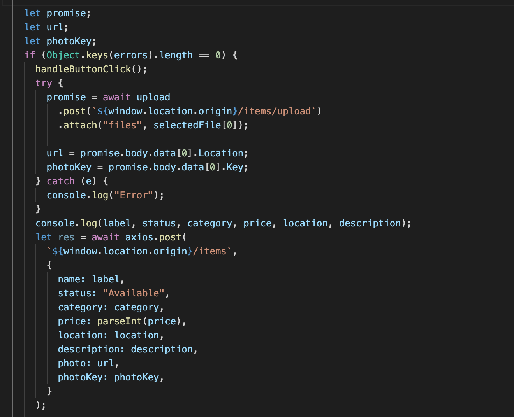
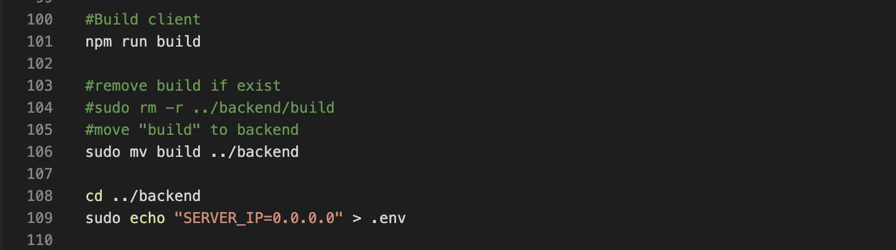

# Sprint-05 Report

### Team Number 03

- Project Manager: Minh Nguyen
- Developer: Jianna Huang
- Jr. Developer: Jessica DeJesus
- IT Operations: Nhan Nguyen
- UI/UX Developer: Wenwen Xie


## Atomic Goals for Sprint-05

- Project Manager
  - Goal setting and ensuring achievement of set goals for that 4th sprint
  - Prepare/document reports
  - Manage JIRA tracking tool
  - Resolve GitHub Issues

- UI/UX Developer
  - Progress Indicators ITEM posting
  - Format view History receipts
  - Add more items
  - User testing for web application interface
  - Continue to implement responsive/interactive design 

- Developer
  - Implement Category function
  - Improve photo validation
  - Search case sensentive functionality
  - Progress indicator
  - Database Dump for ADMIN

- Jr. Developer
  - Ability to view History receipts
  - Admin sessions
  - Admin authorization for delete item
  - Assist with Database dump

- IT Operations
  - Improve the automation
  - Accept cerfiticate
  - Retrieve IP
  - Run app via pm2
  - Research about webpack server


## UI/UX Artifacts

#### Markdown documents with Stories
1. user-story.md - https://github.com/illinoistech-itm/2020-team03r/blob/master/diagrams/user-story.md
2. admin-story.md - https://github.com/illinoistech-itm/2020-team03r/blob/master/diagrams/admin-story.md
3. anon-story.md - https://github.com/illinoistech-itm/2020-team03r/blob/master/diagrams/anon-story.md

### Progress Indicators ITEM posting
- Artifacts 
    - Github URL: https://github.com/illinoistech-itm/2020-team03r/commit/5072fe9683856fe3a30ee9178bc41fb00df6b570 
    - Project Management screenshot: 

    

When posting an ITEM to sell, a progress indicator will appear on the right to let the user know that their posting is being proceeded and should just wait momentarily. We are using the CircularProgress indicators from Material UI. 


### Format view History receipts
- Artifacts 
    - Github URL: https://github.com/illinoistech-itm/2020-team03r/commit/01f7b00d3afe9379fd231d6664fd4b2ef2c5c662
    - Project Management screenshot: 

    

After requesting an item and getting it approved, we want to provide a receipt! This receipt will be available for the buyer once the seller has approved the item.

Alter UI/UX design to reflect history receipt:


The current state of History receipts:


### Add more items
- Artifacts 
    - Github URL: https://github.com/illinoistech-itm/2020-team03r/commit/250321f196a4f5aecd9377a3f9509d59cbae1148
    - Project Management screenshot: 

    

In our cloud-based MongoDB database, we had added enough items. Now for a local MongoDB, our database will become populated with data of items are added by running the RegistrationUsers.js. These items are added on in the database when it initializly set up. 

The state in which new items being shown on the home page


### Continue to implement responsive/interactive design
- Artifacts 
    - Github URL: https://github.com/illinoistech-itm/2020-team03r/commit/503b10a368f5e7612cb248469af1307881552966
    - Project Management screenshot: 

    

All pages are reponsive with UI Materials applied. Enchancements for interactive design is a new layout/presenetation for login and signup. A new design is added to the login and signup pages for the Users. With the new design, the input boxes will be shown once the user hovers to the color blocks.

The current presentation for login and signup


## Developer Artifacts

### Implement Category function
- Artifacts 
    - Github URL: https://github.com/illinoistech-itm/2020-team03r/commit/44d9a4f436b8546dee6379876223b923499bfafa  
    - Project Management screenshot: 

    

Category is one out of two function that allow user to search through items. To get more of a general overview, user can use to filter by category. On the homepage, there is a drop-down menu in which USERs have to ability to select a category and will filter out the homepage itself to only display cards that fall under the selected category. 

A snippet of the function written to filter out the card per category selected:


Alter UI/UX design to reflect implement Category function on the homepage:


The current state of category functionality:


### Improve photo validation

- Artifacts 
    - Github URL: https://github.com/illinoistech-itm/2020-team03r/commit/274837512da3bfcfd24ce8c8fb66236cd83d0890 
    - Project Management screenshot: 

    

From initial photo validation, we have executed a try and catch for when a user attempted to submit an item without a photo, error message with be displayed to the USER.

A snippet of the try and catch improved photo validation:



The current state of photo validation error to the user:


### Search case sensitive functionality

- Artifacts 
    - Github URL: https://github.com/illinoistech-itm/2020-team03r/commit/579fe858f00f42deee4b4d98f78d5c4cf6036e82 
    - Project Management screenshot: 

    

Initially, in the search bar, we had filtered the cards from the exact input a user has entered.  We had not taken into consideration that the search cards, whether their title is capitalized or not, should be displayed if the letters matched up with the user search input. We have now ensured that when filtering the cards, the search term from the user and the name of the card with be lowercased to have a more equal and accurate filtration. 

An example of filtering cards according to the letter entered, not the punctuation. 


A snippet of the adjusted filter function: 


### Progress indicator

- Artifacts 
    - Github URL: https://github.com/illinoistech-itm/2020-team03r/commit/5072fe9683856fe3a30ee9178bc41fb00df6b570 
    - Project Management screenshot: 

    

Progress indicators are triggered when call validation has been passed. An indicator is display to show the action is being proceeded and the user should entered the appropriate information. For progress indicator, it is done according to a timer and are triggered when function is called. 

A snippet of the timed progress indicator: 


### Database Dump for ADMIN

- Artifacts 
    - Github URL: https://github.com/illinoistech-itm/2020-team03r/commit/1b5130caa222fcd044f3e9447141bcf03c50963e 
    - Project Management screenshot: 

    

We have added the ability to export data from your collections. For USER, ITEM, and REQUEST data, we have added admin functionlity to export data in .CSV format per collection. We have specified by a filter per collection to export. We were able to accomplish this by using react-csv and adding a CSVLink button to export specified collection. 

A snippet of the exporting data per collection code import/function: 


### Scripts required to build the Infrastructure for the ability to clone application source code from your private repo to your local application

```Clone git repo
"provisioners": [
    {
    "type": "file",
    "source": "./id_rsa_github_deploy_key",
    "destination": "/home/vagrant/"
    },
    {
      "type": "file",
      "source": "./config",
      "destination": "/home/vagrant/"
    },
    {
      "type": "shell",
      "execute_command" : "echo 'vagrant' | {{ .Vars }} sudo -E -S sh '{{ .Path }}'",
      "inline": [
        "mkdir -p /home/vagrant/.ssh",
        "mkdir -p /root/.ssh",
        "chmod 600 /home/vagrant/id_rsa_github_deploy_key",
        "cp -v /home/vagrant/id_rsa_github_deploy_key /home/vagrant/.ssh/",
        "cp -v /home/vagrant/config /home/vagrant/.ssh/",
        "cp -v /home/vagrant/config /root/.ssh/",
        "git clone git@github.com:illinoistech-itm/2020-team03r.git"
      ]
    },
```
Config file to show where the githib deployed key is located, the key allows the repo to be cloned
```
Host   github.com
Hostname github.com
IdentityFile  /home/vagrant/.ssh/id_rsa_github_deploy_key
StrictHostKeyChecking no
```

Script: ./team03r_script.json

```Automation Build Infrastructure
{
  "builders": [
    {
      "name": "team03r-Ub-svr",
      "vm_name": "team03r-Ub-svr",
      "type": "virtualbox-iso",
      "boot_command": [
        "<esc><wait>",
        "<esc><wait>",
        "<enter><wait>",
        "/install/vmlinuz<wait>",
        " auto<wait>",
        " console-setup/ask_detect=false<wait>",
        " console-setup/layoutcode=us<wait>",
        " console-setup/modelcode=pc105<wait>",
        " debconf/frontend=noninteractive<wait>",
        " debian-installer=en_US<wait>",
        " fb=false<wait>",
        " initrd=/install/initrd.gz<wait>",
        " kbd-chooser/method=us<wait>",
        " keyboard-configuration/layout=USA<wait>",
        " keyboard-configuration/variant=USA<wait>",
        " locale=en_US<wait>",
        " netcfg/get_domain=vm<wait>",
        " netcfg/get_hostname=uvanilla<wait>",
        " grub-installer/bootdev=/dev/sda<wait>",
        " noapic<wait>",
        " preseed/url=http://{{ .HTTPIP }}:{{ .HTTPPort }}/preseed/preseed.cfg<wait>",
        " -- <wait>",
        "<enter><wait>"
      ],
      "boot_wait": "10s",
      "disk_size": 20000,
      "guest_os_type": "Ubuntu_64",
      "http_directory" : ".",
      "http_port_min" : 9001,
      "http_port_max" : 9001,
      "iso_urls": [
        "http://cdimage.ubuntu.com/ubuntu/releases/bionic/release/ubuntu-18.04.4-server-amd64.iso"
      ],
      "iso_checksum_type": "sha256",
      "iso_checksum": "e2ecdace33c939527cbc9e8d23576381c493b071107207d2040af72595f8990b",
      "ssh_username": "vagrant",
      "ssh_password": "vagrant",
      "ssh_port": 22,
      "ssh_wait_timeout": "10000s",
      "shutdown_command": "echo 'vagrant'|sudo -S shutdown -P now",
      "guest_additions_mode": "disable",
      "guest_additions_path": "VBoxGuestAdditions_{{.Version}}.iso",
      "virtualbox_version_file": ".vbox_version",
      "vboxmanage": [
        [
          "modifyvm",
          "{{.Name}}",
          "--memory",
          "2048"
        ]
      ]
      }],

  "provisioners": [
    {
    "type": "file",
    "source": "./id_rsa_github_deploy_key",
    "destination": "/home/vagrant/"
    },
    {
      "type": "file",
      "source": "./config",
      "destination": "/home/vagrant/"
    },
    {
      "type": "shell",
      "execute_command" : "echo 'vagrant' | {{ .Vars }} sudo -E -S sh '{{ .Path }}'",
      "inline": [
        "mkdir -p /home/vagrant/.ssh",
        "mkdir -p /root/.ssh",
        "chmod 600 /home/vagrant/id_rsa_github_deploy_key",
        "cp -v /home/vagrant/id_rsa_github_deploy_key /home/vagrant/.ssh/",
        "cp -v /home/vagrant/config /home/vagrant/.ssh/",
        "cp -v /home/vagrant/config /root/.ssh/",
        "git clone git@github.com:illinoistech-itm/2020-team03r.git"
      ]
    },
    {
    "type": "shell",
  "execute_command" : "echo 'vagrant' | {{ .Vars }} sudo -E -S sh '{{ .Path }}'",
    "script": "post_install_vagrant.sh",
    "environment_vars": [
      "DBPASS={{user `database-root-password`}}",
      "USERPASS={{user `database-user-password`}}",
      "ACCESSFROMIP={{user `database-access-from-ip`}}",
      "DATABASEIP={{user `database-ip`}}",
      "WEBSERVERIP={{user `webserver-ip`}}",
      "DATABASENAME={{user `database-name`}}",
      "DATABASEUSERNAME={{user `database-user-name`}}"
    ]
  }
],
  "post-processors": [
 {
  "type": "vagrant",
 "keep_input_artifact": false,
 "output": "{{.BuildName}}-{{.Provider}}-{{timestamp}}.box"
 }
]
}

```

### The creation of a non-root Database user and a brief explanation the reason for the permissions granted


A non-root Database user is able to read and modify data on non-system collections. The user still has a lot privileges to perform actions on the non-system collections, such as find, insert, remove, update, etc., but they are not able to perfom actions on the system part. This is to protect the database system, and avoids suituation where the server is compromised, which is dangerous.

### Show that database encryption at rest is enabled from the code

Data encryption at rest is only available in MongoDB Enterprise, which is a paid version. We are using MongoDB Community which is free but doesn’t support this function. However, our central database in the cloud is encrypted by default.

Resource: https://docs.mongodb.com/manual/core/security-encryption-at-rest/

## Jr. Developer Artifacts

### Ability to view History receipts
- Artifacts 
    - Github URL: https://github.com/illinoistech-itm/2020-team03r/commit/01f7b00d3afe9379fd231d6664fd4b2ef2c5c662 
- Project Management screenshot: 

    

The ability to view the history receipt is created by adding a button to the item bought section of the profile page. The item will direct the user to the receipt page where the user will see the status of the item as “approved”.

A snippet of the code for the button functionality: 


History receipts for the user is now present as an option:


### Admin sessions

- Artifacts 
    - Github URL: https://github.com/illinoistech-itm/2020-team03r/commit/1b5130caa222fcd044f3e9447141bcf03c50963e 
- Project Management screenshot: 

    

Admin sessions were constantly refreshing and logging out admin immediately after an action was taken. We have altered the period of the session length. An admin will be able to retrieve updated information/state and stayed logged in. It will be store in local storage for admin to view immediately. After being inactive, they will be logged out automatically. 

A snippet of the admin session logic for enabling and or disabling authentication: 


### Admin authorization for delete item

- Artifacts 
    - Github URL: https://github.com/illinoistech-itm/2020-team03r/commit/d52e05eaed7ece827ce3c4d0b5bc30d7b0f65a7f
    - Project Management screenshot: 

    

Functionality to delete all items, users, or request via admin. 

### Assist with the Database dump

- Artifacts 
    - Github URL: https://github.com/illinoistech-itm/2020-team03r/commit/1b5130caa222fcd044f3e9447141bcf03c50963e 
    - Project Management screenshot: 

    

This react-csv npm package allows the generating of a CSV file from the given data. This data can be an array of arrays, an array of literal objects, or strings. The generated CSV file consist of all fields associated with that collection. For example, for ITEM, the fields will consist of the photo, requestID, deniedID, id, name, status, category, price, location, description, photoKey, sellerID, etc.  

The following is an example of exporting all items through admin portal. The top corner is the button to execute to exporting CSV function and .CSV will begin to download shortly afterward.  


### For the 15 “test” user accounts, create 2 actions per user upon automated deploy of the system
- Github URL: https://github.com/illinoistech-itm/2020-team03r/commit/250321f196a4f5aecd9377a3f9509d59cbae1148

We have created script in which seeded the local database started. Automatically creating default users and default items when servers start. 

As shown below are the items per user in MongoDB Compass (35 items): 


### The code the firewall ports opened on each discrete vm

```Clone git repo
# enable and allow ports in firewall
# https://serverfault.com/questions/790143/ufw-enable-requires-y-prompt-how-to-automate-with-bash-script
ufw --force enable
ufw allow proto tcp to 0.0.0.0/0 port 22
ufw allow proto tcp to 0.0.0.0/0 port 80
ufw allow proto tcp to 0.0.0.0/0 port 443
ufw allow proto tcp to 0.0.0.0/0 port 3000
ufw allow proto tcp to 0.0.0.0/0 port 3006
ufw allow proto tcp to 0.0.0.0/0 port 3007
```

## IT Operations

### Improve the automation
- Artifacts 
    - Github URL: https://github.com/illinoistech-itm/2020-team03r/commit/274837512da3bfcfd24ce8c8fb66236cd83d0890 --- testing deployment
    - Project Management screenshot: 

    

For automation, we are building a Ubuntu 18.04.4 64bit VM to run our application. In our team 03 scripts, we initially have to create the VM and clone our repository. As for the post-install script, it will install all needed npm packages and MongoDB. We also have chosen to use pm2 are the process manager that will help with managing and having the Ubuntu server to run our Node.js based application. 

The following are the files needed for building machine for deployment: 


### Accept certificate
- Artifacts 
    - Github URL: https://github.com/illinoistech-itm/2020-team03r/commit/fccc8d468bbf685c58583431bdde5c0ff1a2c874
    - Project Management screenshot: 

    

It is normal for users to have to accept the certificate of web applications. The users are now just prompted right away to accept before proceeding. In deployment, we have the build moved to the backend of application so all can occur in defined port, which in our case is port 3007. 

A snippet in which the build is moved to the backend to they can run co-currently when server is started with pm2:



The following is the cerificate USERs will be prompt to accept before being able to use our web application: 


### Retrieve IP
- Artifacts 
    - Github URL: https://github.com/illinoistech-itm/2020-team03r/commit/fccc8d468bbf685c58583431bdde5c0ff1a2c874
    - Project Management screenshot: 

    

For running the IP address of our VM, in our generate Vagrantfile, we created a private network, which allow host-only access to the machine using our specific IP of 192.168.33.10. To retrieve our IP address, in our post_install script, we have echoed the IP address into our .env folder to configure for the server to run on. 

A snippet of the Vagrantfile which we set the private network:


A snippet of the post_install script which echoed the IP address to run application:


### Run app via pm2
- Artifacts 
    - Github URL: https://github.com/illinoistech-itm/2020-team03r/commit/fccc8d468bbf685c58583431bdde5c0ff1a2c874 
    - Project Management screenshot: 

    

With using a Node.js based web application, pm2, process manager is a package that manage helps for Node-based applications with a built-in load balancer. PM2 will restart the application if it crashes and restart the application as a service every time one restarts the server. PM2 can also ensure that any applications it manages restart when the server reboots, so that the application will start as a service. This manager is needed to start up our application in an Ubuntu server. We install npm pm2 -g to late start up the application through via pm2. 

A snippet from the post-install script where after npm pm2 is installed, we start the application via pm2


## Infrastructure

For our application, for the servers and IP address we have set. This is the diagram for Deployment for our VM set up: 


A list of external packages via our npmanager (these can all be located our package.json files): 

From 2020-team03/photosharingapp/client/package.json
  - "dependencies": {
    - "@blueprintjs/core": "^3.23.1",
    - "@material-ui/core": "^4.8.3",
    - "@material-ui/icons": "^4.5.1",
    - "@material-ui/lab": "^4.0.0-alpha.47",
    - "@reduxjs/toolkit": "^1.2.3",
    - "@testing-library/jest-dom": "^4.2.4",
    - "@testing-library/react": "^9.3.2",
    - "@testing-library/user-event": "^7.1.2",
    - "axios": "^0.19.2",
    - "jwt-decode": "^2.2.0",
    - "material-ui-dropzone": "^2.4.7",
    - "react": "^16.12.0",
    - "react-csv": "^2.0.3",
    v"react-dom": "^16.12.0",
    v"react-redux": "^7.1.3",
    - "react-router-dom": "^5.1.2",
    - "react-scripts": "3.4.0"
  },

From 2020-team03/photosharingapp//package.json
  - "dependencies": {
    - "aws-sdk": "^2.620.0",
    - "bcryptjs": "^2.4.3",
    - "body-parser": "^1.19.0",
    - "concurrently": "^5.1.0",
    - "cors": "^2.8.5",
    - "dotenv": "^8.2.0",
    - "express": "^4.17.1",
    - "is-empty": "^1.2.0",
    - "jsonwebtoken": "^8.5.1",
    - "mongoose": "^5.8.11",
    - "morgan": "^1.9.1",
    - "multer": "^1.4.2",
    - "nodemon": "^2.0.2",
    - "passport": "^0.4.1",
    - "passport-jwt": "^4.0.0",
    - "react-dropzone": "^10.2.1",
    - "request": "^2.88.0",
    - "superagent": "^5.2.2",
    - "validator": "^12.2.0"
  }


## GitHub issues/bugs reported and assigned

1. Proxy error


2. Removing favorited items, but saved state is still there.


3. Search functionality is sensitive


4. Vagrant is unable to mount VirtualBox shared folders


5. The team03 box is not able to find and run in VirtualBox


All issues have been closed and solution/response has been commented. 

